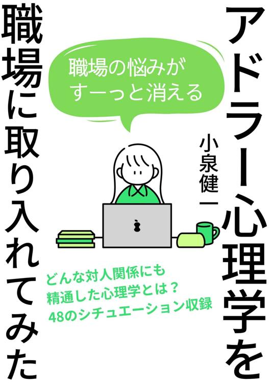
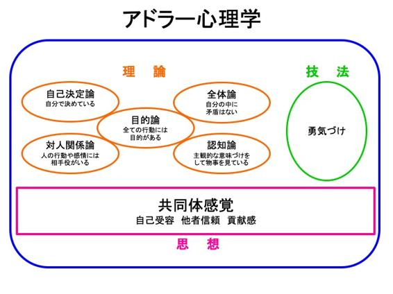

<svg xmlns="http://www.w3.org/2000/svg" xmlns:xlink="http://www.w3.org/1999/xlink" version="1.1" width="100%" height="100%" viewbox="0 0 535 751" preserveaspectratio="none">
<image width="535" height="751" xlink:href="cover.jpeg"></image>
</svg>

# はじめに

   

 　「人生が困難なのではない。あなたが人生を困難にしているのだ。人生は極めてシンプルである」 

   

 　これは心理学者アドラーの言葉です。人は生きていると必ずと言っていいほど悩みを抱えます。あなたも辛い悩み、軽い悩みも含めて様々な思いをしてきたのではないでしょうか。しかし、アドラーは「人生を困難にしているのはあなた自身だ」と言います。それはどういうことなのでしょうか。 

   

 　数多くある書籍の中から本書を手に取っていただきありがとうございます。私はアドラー心理学をベースとしたコーチングを提供しているライフコーチの小泉健一と申します。コーチングとは、クライアントの「こうなりたい」という理想や目標を叶えるために主に対話を通してサポートしていくものです。アドラー心理学は「勇気の心理学」と呼ばれ、過去ではなく現在、そして未来に意識を向ける学問であるため、コーチングとは相性が良く、私以外でもコーチングに取り入れている方がたくさんいます。 

   

 本書は拙著『アドラー心理学を実生活に取り入れてみた』（<a href="XXXXXXXXXXXXXXXXXXXXXXXXXXXXXXXXXX" class="calibre8">https://amzn.asia/d/8wvYuL3</a>）という本の続編となります。前作はより実用的にアドラー心理学を実生活に取り入れてみたらどう変化が起きるのかということを実体験ベースで書いております。 

   

 そして、続編となる本書では、「職場」に的を絞って書いていきます。アドラーは「人の悩みはすべて対人関係にある」とも言っています。まさに「職場」は対人関係の悩みがたくさんあるのではないでしょうか。また、アドラーの考え方として「共同体」を大切にしています。だからこそ、組織や会社という枠組みでアドラー心理学がとても役に立つということがわかります。 

   

 「人間は、集団を作るという方法で困難に立ち向かおうとしてきた。孤立した個人ではなく、社会の一員として生きるのである」（引用元：『生きるために大切なこと』アルフレッド・アドラー著） 

 　 

 人間はひとりでは生きていけませんし、常に集団で生きている生物なのです。職場というものも私たちにとってとても身近な集団であり、アドラーの言葉や考え方がとても役に立つのです。 

   

 そんな職場での生活にアドラー心理学を取り入れたらどうなれるのか。本書でも私の実体験をベースに書いていきます。私はコーチングを始めるよりも前に、会社員としても１０年以上働いております。自分自身いろんな悩みがありましたが、アドラーの考え方で大変救われました。そんな私の実体験と、私の体験だけではなく、もっと様々なシチュエーションでもアドラー心理学がどう効果を発揮するのかをご紹介し、職場での悩みの解決法を網羅したいと思います。よくある悩みを４８のシチュエーションで見ていきます。 

   

 なぜ「体験談」をベースに書こうと思ったのかということをお伝えするのにアドラーの言葉を引用します。 

   

 「心理学は一朝一夕に学ぶことができる科学ではなく、学び、かつ実践しなければならない」 

   

 　アドラー心理学は「使用の心理学」とも言われています。学ぶだけでは身に付かず、実践してこそ価値のあるものになります。しかしながら、よく聞くのが「アドラー心理学を学びたいけど難しくて挫折した」というお声で、それを聞いて非常にもったいないと思いました。アドラー心理学は心理学というより、思想や哲学に近いのでそう感じてしまうのは仕方ないかもしれません。しかし、アドラー心理学ほど実用的な心理学はないと私は考えます。ひとりでも多くの方がアドラー心理学に触れ、人生をより良くしていってほしいという想いで本書を書いています。そのために、極力わかりやすく書くことに注力し、自分事と思ってもらえるように、私は実体験ベースにこだわって書いています。 

 　本編に入る前に私がアドラー心理学と出会って何が変わったのか、どう救われたのかというところもお話したいと思います。少しだけお付き合いください。 

   

 　私は俗に言う「他人の目を気にする」人間でした。 

 　私は自分で言うのも恥ずかしいですが子ども時代は割と勉強は出来る子どもでした。だからこそ、友人や先生からも優等生扱いされ、テストでは低い点数なんて取れないというプレッシャーがありました。幸い「わからないことがわかるようになる」という楽しさを知り勉強は好きでしたので高い得点はキープ出来たのですが、周りからのイメージに合わせようと頑張っている自分がいました。そんな少年時代を過ごしていたので「周りに合わせる」「期待に応える」ということが自分の性となります。（補足ですがアドラーは、性格は５歳くらいから形作られ、１０歳でおおかた完成すると言っています。小さい頃の経験は今の性格の土台となっているのです。とはいえ、アドラーは性格をライフスタイルと呼び、いつからでも自分次第で変えられるとも言っています） 

   

 　学校では人間関係も狭いのでそつなく過ごしていましたが社会人になり壁にぶつかります。会社では「周りに合わせる自己主張の少ない人間」は求められません。自分は言われたことしかできず（入社したての当時は言われたことすらもままならなかったのを覚えています）、自分のふがいなさに絶望しました。毎日怒られてばかりで、通勤中、本気で「この橋から落っこちたらもう仕事のこと考えなくて済むのにな」と考えている時期もありました。 

   

 　でも、私はアドラー心理学の考え方で変わりました。 

 　 

 　アドラー心理学の「目的論」という考え方でやらされ仕事から脱却でき、「全体論」という考え方で心身ともに整えることの大切さを知り、「課題の分離」で相手への期待を手放しメンタルが安定していきました。（これからひとつひとつご説明しますのでご安心ください） 

   

 　アドラー心理学は人生をより良くするために全般的に活用できる考え方であるとは思いますが、本書では「職場」に特化した内容にしております。 

 　厚生労働省の「令和３年　労働安全衛生調査（実態調査）」を見ても、２０歳未満から６０歳以上の年代で「仕事や職業で強いストレスとなっていると感じる事柄がある」と回答している人の割合は、５３．３％と約半数に上ることがわかっております。職場とは、一番身近な共同体だからこそ悩む人が多いのです。 

   

 　会社・組織はまさに「人」で出来ており、対人関係は切っても切れない課題かと思います。そして昨今は人材不足にも悩んでいる企業が多いでしょう。そのためにも「働きたくなる職場」「明日も行きたくなる会社」にする必要があります。 

   

 　リクルートの『新入社員意識調査』における「働いていくうえで大切にしたいこと」という項目で「スキルや知識を身につける」「社会人としてのルールやマナーを身につける」「周囲の人と良好な関係を築く」というのがトップ３でした（２０２２年調査）。一方で「失敗を恐れずにどんどん挑戦する」「何事も率先して真剣に取り組む」「新しい発想で職場に刺激を与える」という項目は年々下がっています。 

 　どうでしょうか。もしあなたが上司の立場だったら後者の「挑戦してほしい」「率先して真剣に取り組んで欲しい」「職場に新しい風を吹かせてほしい」と新人には期待しているのではないでしょうか。しかし、当の本人たちはそれを望む人が少なくなっているのです。 

   

 　このように、年々、会社や組織で働く人の想いは変化しています。いつまでも自分の常識で仕事はできません。職場はまさに「対人関係」がリアルに現れる場です。そんな職場に私はアドラー心理学が必要だと感じております。それはアドラーが「人間の悩みはすべて対人関係である」と言っていることが理由としてあります。アドラー心理学を取り入れれば、対人関係の悩みが解決できます。もちろん一気にはできないかもしれません。しかし、私が変わることができたように、誰でもできると思うのです。 

   

 　本書は組織や会社で働く人のあらゆる立場の人にも役に立つ本としています。会社に入りたての新人から、中堅社員、管理職まで、立場によってさまざまな悩みや課題があるでしょう。各章を「人間関係」「仕事のやりがい」「マネジメント（人材育成）」の３つの観点で分け、どんな立場の人でも学べるようにまとめました。私自身、会社に１０数年所属しているため、新人や中堅社員、マネジメントについてなどすべて経験してきています。その経験や学びを活かし、これらの分野で感じてきた悩みがアドラー心理学を取り入れたことで、どう変化していったのかを体験談ベースでお伝えしていきます。 

   

 本書では様々な悩みのシチュエーションとともにアドラー心理学のどの考え方で解決できるかを書いていますが、何度も同じ考え方が出てきます。「またか」「同じことばかり」と思う人も多いと思いますが、それだけどんな悩みに対しても同じ考え方で対処できるということです。アドラー心理学にまだ触れたことのない方にもしっかりご理解いただくために同じ説明をすることも多々ありますがご了承ください。アドラー心理学をマスターすれば、多様な悩みに対して解決できるようになるので楽しみにしてくださいね。 

 　 

 　最後にひとつあなたにお願いしたいのは、頑張り過ぎないことです。確かにアドラー心理学で職場での生活をより良くすることはできると考えておりますが、自分の心身に危険を感じたらすぐに逃げてください。決して「自分はダメな人間だ」というふうに考えないようにしましょう。アドラー心理学はあくまで「手法」であり、その手法が役に立たないことだってあります。罵詈雑言を浴びせてくる上司やパワハラなどの被害に遭っている方は、アドラー心理学を取り入れる以前にしかるべき部署に報告したり、カウンセリングを受けたり、自分を守る術を使ってください。本書はあくまで自力でできる範囲に限り改善できる手法をお伝えする内容になります。ご了承ください。 

   

 　人は誰でも悩みます。アドラーは「悩みをゼロにするには、宇宙でたったひとりきりになるしかない」と言います。悩みを抱えない人などいないのです。だから、今あなたが悩んでいても大丈夫。自分と向き合い、自分の感情や価値観を大切にし、人と接していけばきっと状況は良くなります。 

   

 本書を読んでくださった方が少しでも職場での環境、自分自身の仕事のやりがい、部下や後輩の育成やコミュニケーションを良い方へ改善でき、あなた自身が成長できることを心から願っております。 

 

 

 目次 

   

 <a href="XXXXXXXXXXXXXXXXXXXXXXXXXXXXXXXXXX" class="calibre8">はじめに</a> 

 <a href="#part0001.html#_第１章_アドラー心理学とは_1" class="calibre8">第１章　アドラー心理学とは</a> 

 <a href="#part0002_split_001.html#__アドラー心理学の五大理論" class="calibre8">◆アドラー心理学の五大理論</a> 

 <a href="#part0002_split_002.html#__アドラー心理学の考え方やアプローチ法" class="calibre8">◆アドラー心理学の考え方やアプローチ法</a> 

 <a href="#part0002_split_003.html#__アドラー心理学の最終目標《共同体感覚》" class="calibre8">◆アドラー心理学の最終目標《共同体感覚》</a> 

   

 <a href="#part0003.html#_第２章_組織とアドラー心理学の関係性" class="calibre8">第２章　組織とアドラー心理学の関係性</a> 

   

 <a href="#part0004_split_000.html#_第３章_「人間関係」に取り入れてみた" class="calibre8">第３章　「人間関係」に取り入れてみた</a> 

 <a href="#part0004_split_001.html#_【会社の雰囲気に馴染めない】" class="calibre8">【会社の雰囲気に馴染めない】</a> 

 <a href="#part0004_split_002.html#_【頼まれごとを断れない】" class="calibre8">【頼まれごとを断れない】</a> 

 <a href="#part0004_split_003.html#_【先輩に話しかけづらい・報告するのが怖い】" class="calibre8">【先輩に話しかけづらい・報告するのが怖い】</a> 

 <a href="#part0004_split_004.html#_【価値観を押し付けられる】" class="calibre8">【価値観を押し付けられる】</a> 

 <a href="#part0004_split_005.html#_【相手の反応を気にして意見が言えない】" class="calibre8">【相手の反応を気にして意見が言えない】</a> 

 <a href="#part0004_split_006.html#_【ミスをして怒られて凹む】" class="calibre8">【ミスをして怒られて凹む】</a> 

 <a href="#part0004_split_007.html#_【他人と比べてしまう】" class="calibre8">【他人と比べてしまう】</a> 

 <a href="#part0004_split_008.html#_【リモートワークでコミュニケーションが取りづらい】" class="calibre8">【リモートワークでコミュニケーションが取りづらい】</a> 

 <a href="#part0004_split_009.html#_【社外の人とのコミュニケーションに悩む】" class="calibre8">【社外の人とのコミュニケーションに悩む】</a> 

 <a href="#part0004_split_010.html#_【顧客対応によるストレス】" class="calibre8">【顧客対応によるストレス】</a> 

 <a href="#part0004_split_011.html#_【上司に認められない】" class="calibre8">【上司に認められない】</a> 

 <a href="#part0004_split_012.html#_【他人のせいにする人に困っている】" class="calibre8">【他人のせいにする人に困っている】</a> 

 <a href="#part0004_split_013.html#_【愚痴ばかり言う人に困っている】" class="calibre8">【愚痴ばかり言う人に困っている】</a> 

 <a href="#part0004_split_014.html#_【人によって態度を変える人に嫌気がさす】" class="calibre8">【人によって態度を変える人に嫌気がさす】</a> 

 <a href="#part0004_split_015.html#_【嫌がらせを受けている】" class="calibre8">【嫌がらせを受けている】</a> 

 <a href="#part0004_split_016.html#_【働かない人がいて困る】" class="calibre8">【働かない人がいて困る】</a> 

   

 <a href="#part0005_split_000.html#_第４章_「仕事のやりがい」に取り入れてみた" class="calibre8">第４章　「仕事のやりがい」に取り入れてみた</a> 

 <a href="#part0005_split_001.html#_【仕事のやりがいが見出せない】" class="calibre8">【仕事のやりがいが見出せない】</a> 

 <a href="#part0005_split_002.html#_【失敗が怖くてチャレンジできない】" class="calibre8">【失敗が怖くてチャレンジできない】</a> 

 <a href="#part0005_split_003.html#_【チャレンジ出来ない風土に悩む】" class="calibre8">【チャレンジ出来ない風土に悩む】</a> 

 <a href="#part0005_split_004.html#_【会社のやり方に疑問】" class="calibre8">【会社のやり方に疑問】</a> 

 <a href="#part0005_split_005.html#_【ストレスが溜まり続ける】" class="calibre8">【ストレスが溜まり続ける】</a> 

 <a href="#part0005_split_006.html#_【自分に自信が持てない】" class="calibre8">【自分に自信が持てない】</a> 

 <a href="#part0005_split_007.html#_【仕事が覚えられない】" class="calibre8">【仕事が覚えられない】</a> 

 <a href="#part0005_split_008.html#_【怒られて自信を失う】" class="calibre8">【怒られて自信を失う】</a> 

 <a href="#part0005_split_009.html#_【会社に未来を感じない・出世が期待できない】" class="calibre8">【会社に未来を感じない・出世が期待できない】</a> 

 <a href="#part0005_split_010.html#_【転職したいが辞めるのが怖い】" class="calibre8">【転職したいが辞めるのが怖い】</a> 

 <a href="#part0005_split_011.html#_【不当な人事評価に納得いかない】" class="calibre8">【不当な人事評価に納得いかない】</a> 

 <a href="#part0005_split_012.html#_【自分の境遇に納得いかない】" class="calibre8">【自分の境遇に納得いかない】</a> 

 <a href="#part0005_split_013.html#_【仕事に向いてない_と悩む】" class="calibre8">【仕事に向いてない…と悩む】</a> 

 <a href="#part0005_split_014.html#_【理想と現実のギャップに悩む】" class="calibre8">【理想と現実のギャップに悩む】</a> 

 <a href="#part0005_split_015.html#_【自分の仕事に満足できない】" class="calibre8">【自分の仕事に満足できない】</a> 

 <a href="#part0005_split_016.html#_【休みの日も仕事が気になる・月曜日が憂鬱】" class="calibre8">【休みの日も仕事が気になる・月曜日が憂鬱】</a> 

 <a href="#part0005_split_017.html#_【ワークライフバランスが崩れる】" class="calibre8">【ワークライフバランスが崩れる】</a> 

 <a href="#part0005_split_018.html#_【残業が多い】" class="calibre8">【残業が多い】</a> 

 <a href="#part0005_split_019.html#_【休職する】" class="calibre8">【休職する】</a> 

   

 <a href="#part0006_split_000.html#_第５章_「マネジメント（人材育成）」に取り入れてみた" class="calibre8">第５章　「マネジメント（人材育成）」に取り入れてみた</a> 

 <a href="#part0006_split_001.html#_【管理職になり無理をしてしまう】" class="calibre8">【管理職になり無理をしてしまう】</a> 

 <a href="#part0006_split_002.html#_【上司と部下の板挟み】" class="calibre8">【上司と部下の板挟み】</a> 

 <a href="#part0006_split_003.html#_【部下が不満を持っている】" class="calibre8">【部下が不満を持っている】</a> 

 <a href="#part0006_split_004.html#_【部下が言うことをきかない】" class="calibre8">【部下が言うことをきかない】</a> 

 <a href="#part0006_split_005.html#_【言われたことしかやらない部下がいる】_1" class="calibre8">【言われたことしかやらない部下がいる】</a> 

 <a href="#part0006_split_006.html#_【注意したり人に指示したりするのが苦手】" class="calibre8">【注意したり人に指示したりするのが苦手】</a> 

 <a href="#part0006_split_007.html#_【部下に任せられない。つい自分でやってしまう】" class="calibre8">【部下に任せられない。つい自分でやってしまう】</a> 

 <a href="#part0006_split_008.html#_【部下と充分な関係性が取れていない】" class="calibre8">【部下と充分な関係性が取れていない】</a> 

 <a href="#part0006_split_009.html#_【チームがバラバラに_】" class="calibre8">【チームがバラバラに…】</a> 

 <a href="#part0006_split_010.html#_【ついつい原因追及してしまう】" class="calibre8">【ついつい原因追及してしまう】</a> 

 <a href="#part0006_split_011.html#_【部下の価値観を理解できない】" class="calibre8">【部下の価値観を理解できない】</a> 

 <a href="#part0006_split_012.html#_【周りのやる気を削ぐメンバーがいる】" class="calibre8">【周りのやる気を削ぐメンバーがいる】</a> 

 <a href="XXXXXXXXXXXXXXXXXXXXXXXXXXXXXXXXXX" class="calibre8">【Ｚ世代の指導方法がわからない】</a> 

   

 <a href="XXXXXXXXXXXXXXXXXXXXXXXXXXXXXXXXXX" class="calibre8">あとがき</a> 

   

 <a href="#part0008.html#_著者紹介_1" class="calibre8">著者紹介</a> 

# 

# 第１章　アドラー心理学とは

 　 

 　まず、アドラー心理学とはどんなものかを解説したいと思います。本章は拙著『アドラー心理学を実生活に取り入れてみた』でも解説している部分になりますので、前作を読んでくださった方やすでにアドラー心理学の概要についてご存知の方は飛ばしてください。アドラー心理学がどういったものなのか把握したい方はぜひ読み進めてください。本章が全体の核の部分になります。 

   

 アドラー心理学の創設者であるアルフレッド・アドラーは、フロイト、ユングと並び近代の心理学の三大巨匠とされている人物です。 

   

 　 

   

 　アドラーは、１８７０年にオーストリアに生まれました。中産階級の家庭の７人兄妹の次男として生まれます。彼の幼少期の家庭環境や経験がのちのアドラー心理学の考え方に非常に関わってきます。 

 　アドラーは、弟をジフテリアという感染症で亡くし、自身も「くる病」という骨が曲がってしまう病気にかかっていて病弱でした。このような経験からアドラーは、医学の道を歩むことを決意します。 

   

 　２７歳で開業したアドラーは、患者たちを診療していくなかで、身体的ハンディキャップを抱えた人たちがそれをバネに克服していく姿を見て「劣等感」について考えがまとまってきました。人は、劣等感を糧として、自分の欠点を克服しようと努力することができると考え、『器官劣等性の研究』という本を出版。自身も「くる病」というハンディキャップを抱えていた為、客観的に見て身体的に劣っていることを「器官劣等性」と名付けました。 

   

 　『器官劣等性の研究』を読んだフロイトが大絶賛。アドラーに手紙を出しアプローチします。心理学の三大巨匠のフロイト、ユング、アドラーですが、フロイトが一番先輩です。フロイトが活躍していたなか、フロイトの研究会にアドラーとユングが参加していた形になります。 

   

 　１０歳以上先輩のフロイトの研究会にアドラーは参加するようになりました。フロイトは「無意識」について研究し「潜在意識」という概念を創出した偉大な心理学者で当時すでに有名人でした。 

   

 　しかし、のちにアドラーはフロイトと決別します。「無意識」についての考え方で意見が割れたのです。フロイトは「無意識」というのは「意識」とは別に存在していて「意識」と独立することもあると考えていましたが、アドラーは「意識」も「無意識」も同じひとりの人間の意識であるという主張を崩しませんでした。 

 これをキッカケにフロイトとは考え方が一致しないということがわかり、アドラーは協会を辞職。数人の仲間とともに、『個人心理学学会』を創設。フロイトとは別で自身の考え方や理論を研究するようになりました。 

   

 　１９１４年の第一次世界大戦には、精神科医の軍医として従軍。そのなかで傷ついた兵士たちを診療し、戦場でまだ戦えるのか判断するという非常に心が痛い仕事をしておりました。家族と次にいつ会えるかわからない兵士たちのこれからの運命を左右するような判断をする毎日に、アドラー自身も悩んでいきます。このような戦争の経験から「人は皆ひとつの仲間であり、争わなければこのような悲しい思いはしないハズだ」とのちに「共同体感覚」と言われるアドラー心理学では根幹となる考え方が生まれました。「共同体感覚」は簡単に言えば、「人はひとりひとり独立したものではなく、仲間や社会、広く言うと全人類、地球ともひとつであり、すべてに属している」という考え方です。詳しくは後述します。 

   

 　こうしてアドラーは自身の考え方を個人心理学としてまとめあげていきました。正式名称は『個人心理学』ですが、日本では一般的に使われている『アドラー心理学』という言葉で本書は統一していきます。 

   

 　晩年も本業で多忙な中、世界各国で講演を行っていました。こうした講義や名言をまとめた本もミリオンセラーになり、一躍世界中で個人心理学の考え方が浸透していきました。 

 ヨーロッパ各地で講演を行っていたさなか、心臓発作で倒れ、そのまま亡くなってしまいました。享年６７歳でした。 

   

 彼は自分で書いた本をあまり残しておりませんでしたので、フロイトとユングと比べると知名度はそんなにありませんが、その理由はアドラーの次の言葉でわかります。 

 「誰ももう、わたしの名前など覚えていないときがくるかもしれません。個人心理学という学派の存在さえ、忘れられるときがくるかもしれません。けれども、そんなことは問題ではないのです。なぜなら、この分野で働く人の誰もが、まるでわたしたちと一緒に学んだように行動するときがくるのですから。」 

   

 　個人心理学が忘れ去られても、同じような分野で働く人が現れる。どんなに時代が流れても、個人心理学＝アドラー心理学の考え方は人々の役に立つと確信していたのです。 

   

 　アドラー心理学の全体像は次の通りです。 

   

  

 　アドラー心理学の理論としては、「自己決定論（「主体論」と言うことも）」「目的論」「全体論」「対人関係論」「認知論」の５つがあり、ベースとなる思想が「共同体感覚」となっています。「勇気づけ」という生きる勇気を与える技法もあります。 

 これらはすべて職場での悩みに役に立ちます。アドラーが言う人類の最終ゴールである「共同体感覚」はまさに職場という共同体では必要不可欠な考え方です。この五大理論について最初に説明していきましょう。サクッと概要だけ触れて、あとは次回以降の章で実体験ベースでよりわかりやすく身近に感じてもらえるように書いていきます。 

   

   

## ◆アドラー心理学の五大理論

 ①        自己決定論・・・自分のことは自分で決めている。主体論とも言われる。すべて自分で選択できる。この感覚が幸福度に繋がる。これからの未来は自分でいくらでも変えることができる。過去がどうだったかは関係ない。今これから自分が何をしていきたいかで人生はいかようにも変えられる。人生の主人公はあなた自身である。 

 ②        目的論・・・人の行動にはすべて目的がある。過去に囚われて行動できないというのは嘘。人間は目的に向かって生きているので過去がどうであれ、目的次第で人生は変えられる。自分のことも他人のことも「どんな目的があるのか」ということを考えれば人生の意味も変えていくことができる。 

 ③        全体論・・・心と体、感情と思考、意識と無意識、すべてひとつの統一体。そのすべてが自分という存在で矛盾はない。「やりたくないけど仕方なくやっている」ということのように、自分の想いと実際にやっていることが違っていたら、自分の本音を探ってみること。 

 ④        対人関係論・・・人の行動や感情にはすべてに相手がいる。人の悩みはすべて対人関係に帰結する。悩みや不平不満があった場合は誰に対してどのような感情があるのか考えてみること。 

 ⑤        認知論・・・人は見たいように世界を見ている。物事には良いも悪いも意味はなく、世の中すべて自分の解釈であり、人それぞれの認知がある。自分の見方・価値観・認知がどうなっているのか把握すると自分のことも他者のことも理解しやすくなる。 

   

## ◆アドラー心理学の考え方やアプローチ法

 「課題の分離」・・・課題や問題が生じたときは自分でコントロールできることなのかそうではないのか考えること。他者の課題であれば介入しないこと。自分の課題であれば他者を介入させないこと。人の意見や批判は気にする必要はない。 

   

 「勇気づけ」・・・「勇気」とは「困難を克服する活力」である。部下や子どもを教育するときや友人を励ますときは、「勇気」を与えるように接しよう。「褒める」「叱る」という上下関係ではなく、対等な横の立場から感謝や気持ちを伝えたり、結果だけではなく過程を見てあげたり、存在や行動をまず受け入れてあげること。相手が主体的に行動できるように接しよう。 

   

## ◆アドラー心理学の最終目標《共同体感覚》

 　人は他者への貢献で本当の幸福を感じる。ありのままの自分を受け入れる「自己受容」、他者は自分を支えてくれているという「他者信頼」、自分は他者へ貢献しているという「自己信頼（他者貢献）」を感じることで、自分はここにいていいんだという「所属感」を持つことができる。それが「共同体感覚」へ繋がる。自分の家族、友人関係、職場、祖国、地球、宇宙、という幅広い共同体の中で自分は貢献できているという感覚を手に入れることを目指そう。 

   

 アドラー心理学を学ぶ上で「共同体感覚」は一番と言っていいほど大切な思想なので、アドラーの言葉もご紹介します。彼は著書のなかでこう言います。 

   

 「社会に適応することは、劣等という問題と表裏一体だ。一人の個人は弱く、劣っているために、人間は社会を作るのである。つまり共同体感覚と社会的な協力は、個人を救済する役割を果たしているのだ」（『生きるために大切なこと』） 

   

 「どんな完全な人間でも、共同体感覚を養い育て、それを十分に働かせることなしには成長できないのである」（『人間知の心理学』） 

   

 「われわれが反対しなければならないのは、自分自身への関心だけで動く人である。この態度は、個人と集団の進歩にとって、考えられるもっとも大きな障害である。どんなものであれ、人間の能力が発達するのは、仲間の人間に関心を持つことによってだけである」（『人生の意味の心理学下』） 

   

 　人類は、ひとりでは生きていけないから社会集団を形成して生きていきます。だからこそ、自分が所属している共同体での自分の感覚が大切なのです。共同体感覚は特に重要な思想なのでこのあともキーワードとしてたくさん出てきます。よく覚えておいてください。 

   

 　以上が、アドラー心理学の基礎となる五大理論と考え方です。概念だけでは抽象的でわかりづらいと思いますのでこれから詳しく実体験ベースでお伝えしていきます。次章では、まず会社や職場を考えるうえで「組織」についてその定義と課題点を書いていきます。 

 

 

# 第２章　組織とアドラー心理学の関係性

   

 　会社や組織での悩みに触れる前に「組織とは何か」ということについて書いておきたいと思います。組織の前提を知っておくことで、それにどうアドラー心理学が即していくか理解しやすくするためです。 

   

 　組織の定義とは、共通の目標や目的を共有し、それを達成するために協働を行う集団を言います。ここで大事なのは「共通の目標や目的を共有する」ということでしょう。当たり前のことではありますが、これが出来ていない組織も多いのではないでしょうか。かくいう私の会社も、会社のビジョンが末端まで浸透しているかというとそうとは言いきれません。組織の皆が全員、目標や目的を共有するためには、コミュニケーションが必要です。会社や組織は「人」で出来ています。対人関係がすべてだといっても過言ではないでしょう。 

   

 　では、組織の目的は何でしょうか。私なりの言葉で表現すると、社会や人々に貢献し、長期的に存続発展することだと考えます。長期的というのがポイントです。短期的な成果を求める場合にもチーム編成をすることはありますが、その場合は組織のメンバー間の連携よりも個人のスキルが重要視されるでしょう。会社という組織は未来永劫、存続発展することを目的としていますので、長く関わるメンバー間の関係性が非常に重要になります。経営層と従業員の意識の違いによって不祥事を起こしてしまう会社もたまにニュースで目にしますね。 

   

 　組織の定義について、もう少し深掘りします。職場風土改善の専門家でもある中村英泰氏は著書のなかでこう言います。 

   

 「そもそも、『組織の成立』を、チェスター・バーナード氏の唱えた理論をもとに考えると、『貢献意欲／組織のビジョン達成に貢献したい意欲』、『共通の目的／組織と社員に共通する目的』、『コミュニケーション／組織の諸情報を共有』の３つの要素が必要とされています。ということは、現組織に、この３つが成立していなければ、それは「組織ではない」ということになります。（引用元：『社員がやる気をなくす瞬間』中村英泰著　アスコム） 

   

 　こう聞くと組織がしっかり組織として機能することはハードルが高いと感じそうですが、私はひとつひとつ順番に達成していけばいいと考えます。 

   

 　中村英泰氏の言葉を借りれば、組織が組織として機能するためには、目標や目的を共有するだけではなく、組織の目的に貢献したいとメンバーに感じてもらえているかということも大事なのです。 

   

 　もう一度、組織の定義を振り返りましょう。 

 「共通の目標や目的を共有し、それを達成するために協働を行う集団」 

 　この組織の定義を体現するためには何が必要か。 

   

 　私はコミュニケーションだと断言します。コミュニケーションなくして人は意思疎通ができませんし、想いを共有することもできません。人と人との関係やコミュニケーションが組織を成り立たせるのに不可欠なのです。 

 　 

 　しかしながら、昨今は組織のメンバーでのコミュニケーションが希薄になることも多いのではないでしょうか。テレワークをする機会が増え、電話よりもチャットツールでの連絡手段がスタンダードになり、会議もZoomで声だけで行われたりしています。それが悪いわけではありません。このような効率化によって生み出された可処分時間を別の仕事に使い、より成果を挙げることができることは組織にとっては大きなメリットになります。 

   

 　ただ、どんなことも効率化すればいいというものでもありません。効率化しながらも、組織のメンバーとの「関係密度」は深くしていかなければ、組織の定義である「共通の目標や目的を共有し、それを達成する」ことは出来ません。効率化ばかり追い求めて、「関係密度」が薄まり、組織の定義を疎かにしていては意味がないのです。効率化することでやり方が変わったのであれば、それに合った組織のメンバーとのコミュニケーション方法を考えるしかありません。 

 　そしてコミュニケーションは独りよがりでは成立しません。相手の気持ちをよく聴くこと、相手のことを尊重することが必要です。そのためにアドラー心理学はもってこいなのです。 

   

 　アドラーは人類の目指すべき最終ゴールとして「共同体感覚」というものを挙げていると前章でお伝えしました。組織という共同体でメンバーひとりひとりが主体的に動き、共通する目標を達成し、成果を出して組織が存続発展していくためにアドラー心理学が非常に役に立ちます。 

   

 　昨今「ティール組織」という言葉をよく聞く人も多いかと思います。上から下へのトップダウンの指示で動く組織ではなく、メンバーがそれぞれに役割があり決裁権を持たせ、それぞれが主体的に働く組織のこと。日本は元来トップダウンの企業が多かったのでなかなか馴染みはないですが、アメリカなどではこの「ティール組織」で運営している会社も少なくありません。ティール組織のメリットとしては役職の上下の関係がなくフラットな関係性のため業務も効率化できますし、皆が主体的に動いているので当事者意識も強まり、アドラーの言う「共同体感覚」がとても強く持てる組織になります。 

   

 　もちろんトップダウンの指示のほうがうまくいくときもありますし、ティール組織のやり方がどの組織にも当てはまることはないですが、私はアドラー心理学を取り入れた組織の理想形はこのティール組織だと考えています。この辺りも踏まえて本書では、職場にアドラー心理学を取り入れてみたらどうなれるかということをお伝えしていきたいと思います。 

   

 　本書を読んでくださった方が少しでも自分の職場で活かしてくださり、そして、今よりももっと楽しくやりがいを持って仕事が出来ることを願って本章を終えるとします。次章から、実際にアドラー心理学を取り入れてみた経験をご紹介します。 

   

   

 

# 第３章　「人間関係」に取り入れてみた

 　本章では、職場の悩みで一番多いであろう「人間関係」についての事例を取り上げていきます。アドラーは人間関係を厄介なものにする性格として「虚栄心」と「嫉妬」を挙げています。人間関係の悩みも、相手のせいにしがちですが、自分自身の見方が影響していることも多いのです。というよりも、何事も自分の責任だと思う生き方の方が楽です。人のせいにしがちな人も、アドラー心理学を通して、自責思考への考え方になれる方法をこれから紹介していきます。それでは、「人間関係」の悩みについて、私の体験談も踏まえてご紹介します。 

   

   

## 【会社の雰囲気に馴染めない】

 　新人の場合、期待を膨らませ、会社に入社したものの、「思っていたのと違う」「周りの先輩たちが怖くて居心地が悪い」「職場の雰囲気が合わない」と感じて悩んでいる人もいるのではないでしょうか。中堅社員の方も部署異動で環境の変化があると、なかなかその雰囲気に馴染めない方もいるでしょう。 

 私自身も新人の頃は、自分が想定していた仕事内容、仕事量、職場環境と実際のものは違いました。私はよく友人との飲み会で愚痴を言ったり、他人をうらやましがったりしていたような気がします。具体的には、土日でも電話が鳴ることや、やることが多すぎること（営業職なのに他社では別部署のやることであろう業務もあったのです）に不平不満を言っていました。当時はなんとか耐え抜いていましたが、今思うと次のアドラーの言葉を当時の自分にかけてあげたいです。 

   

 「どんな能力をもって生まれたかはたいした問題ではない。重要なのは、与えられた能力をどう使うかである。」 

 　 

 私はこの言葉にとても救われ、今でも座右の銘として心に刻んでおります。この「能力」は何に置き換えてもいいと思っています。例えば今回の「職場の雰囲気=環境」にも置き換えられます。 

 会社の雰囲気に馴染めないということも、どんな会社の環境なのかはたいした問題ではなく、その与えられた環境で自分がどうするかが大事なのです（もちろんパワハラやサービス残業が横行しているような非人道的な環境は論外です）。 

 当時の新人時代の私は、自分でコントロール出来ないことを他人へ愚痴を言っているだけでした。これだと何も変わりません。本当にその環境が不満で納得いかないのであれば、自分で何かアクションを起こすしかないのです。会社の雰囲気に馴染めないと感じている人は、自分に何が出来るのかを考えてみましょう。それに手助けが必要であれば、職場の人に相談してみましょう。厳しい言い方かもしれませんが、嘆いているだけでは何も変わりません。 

   

 私自身は、「どんな会社に行っても、大変なことはそれぞれある。自分の環境を嘆いているのは自分だけではなく、他の会社の人もそうだろう」と思うようにして今の自分はどうしたいのかを大切にするようにしました。諸先輩方は楽しそうに仕事をしていて、それを見ていると自分もそうなれるだろうと思っていましたので、愚痴を言ったり納得いかなかったりしていたことも、将来のためだと思うようにして乗り越えていくことができたのです。このように自分の解釈が変われば同じ仕事内容でも感じ方が変わっていきます。 

   

 喜劇王のチャップリンの言葉で次のような名言があります。 

 「人生はクローズアップで見れば悲劇だが、ロングショットで見れば喜劇である」 

 あなたが今「会社の雰囲気に馴染めない」と悩んでいることも、ロングショット＝長い目で見てみると解釈が変わってくることもあるのではないでしょうか。与えられた環境をどのように使うか、という視点で考えてみましょう。 

   

## 【頼まれごとを断れない】

 　先輩から仕事を頼まれたとき、本当は他に仕事がたくさんあっていっぱいいっぱいなので断りたいと思っても相手が先輩だとなかなか断れないこともありますよね。ただ、我慢してあなたが潰れてしまっては元も子もありません。あなたはなぜ断れないのでしょうか。 

 「断ったら新人のくせに生意気だと怒られそう」「これくらいで仕事断ったら今後何も任せてもらえなさそう」「単純に言いづらい…」 

 色々な理由があるでしょう。私もＮＯと言いづらい性格ですのでよくわかります… 

 しかし断わったときに相手がどう反応するかは相手にしかわからないことです。何を言われるかもあなたの想像の範囲でしかないのです。 

 　私の友人の事例を紹介します。その友人はすべて自分で抱え込む性格でした。先輩からの依頼の仕事をすべてこなすことで自分の存在価値があると心の底から思っていたのです。でも、そのせいでつぶれそうな友人を見ていて「このままではまずいな」と感じた私は、アドラー心理学の「課題の分離」の考え方を伝えました。 

   

 　「課題の分離」とは、自分のことは自分で、他人のことは他人でしかコントロールできない、自分と他人の課題を分けるということです。コントロールできないことに悩んでいても思うようにいかずただ苦しいだけ。 

 友人には、自分のことと先輩（他人）のことは別で考えるべきということを伝えたのを覚えています。断ったときに先輩にどのように思われるか、評価が下がるのではないかと気にしていたので、そう伝えたのです。断わったときに先輩がどう思うかは先輩の課題です。何よりも自分が大事です。もちろん仕事を教えてもらうことも大切ですが、自分の体調に影響が出るのはよくありません。「ＮＯ」と言える勇気も持ちましょう。その友人は結果的に「他にもやることがあって今はちょっと厳しいです」とやんわり断ったそうで、先輩の反応も案外あっさりしていたと言っていました。「自分の気にし過ぎだった」と肩の荷が下りたようにスッキリしていましたね。 

   

 　他人は案外自分のことを気にしていません。不安や心配は自分が勝手に作り出していることも多いのです。「課題の分離」を意識して、今悩んでいることが自分のことなのか、他人のことなのかを明確に区分しましょう。 

   

## 【先輩に話しかけづらい・報告するのが怖い】

 　忙しそうな先輩にはなかなか話しかけづらいですよね。仕事の相談をしたくても私もよく様子を伺っていました。先輩は「いつでも何でも聞いて」と言ってくれますが、私は他人の目を気にするタイプだったので、「今話しかけたら迷惑かな」と思ってなかなか声を掛けることが出来ませんでした。私は失敗したときも同じで、失敗こそ早く報告しないといけませんが、なかなか言い出しづらかったので、報告が遅くなり、さらに怒られることに…。 

   

 　こんなときに役に立つアドラー心理学の考え方として「認知論」」というものがあります。それに関して、アドラーの言葉を引用します。 

   

 「ピンク色のレンズの眼鏡をかけている人は世界がピンク色だと勘違いをしている。自分が眼鏡をかけていることに気づいていないのだ。」 

   

 　アドラー心理学でよく「認知のメガネ」と言われます。人は自分の見たいように世界を見ています。自分がこうだと思ったらそのようにしか思えなくなるようなことってありませんでしょうか。例えば、知人の嫌なところがひとつでも垣間見えると、もうその人が嫌な人にしか思えなくなるように。 

 　このように人間は自分の解釈で物事を見ています。「先輩に話しかけづらい」と思っているのもあなただけの解釈なのです。先輩はなんとも思っていないかもしれません。思い切って話しかけてみましょう。先ほども言ったように私は他人の目を気にする性格だったので、相手がどう思うかばかり考えていたのですが「迷惑にならないかな」とか「そんなこともわからないのかと思われていないかな」とか、あることないこと心配していたことも、すべて私自身の「認知のメガネ」を通しての解釈だったと気が付いたのです。 

 　それからは思い切って話しかけることができるようになりました。「今話しかけられたら迷惑だ」と先輩が思っているかもしれないという不安は抜けませんでしたが、それは私の解釈なので気にしないことにしたのです。 

 　先ほど紹介した「課題の分離」も役に立ちます。自分のことは自分でしか解決できない、他者のことは他者でしか解決できない。先輩がどういうふうにあなたのことを思うかは先輩しかわかりません。先輩の課題なのです。その先輩の課題に対して自分が考えることほど無駄なことはありません。相手の反応が怖かったら「課題の分離」を思い出しましょう。 

   

 　 

## 【価値観を押し付けられる】

 先輩や上司に価値観を押し付けられて苦しい経験をした方もいるのではないでしょうか。 

 　私は、営業の仕事をしていますが口下手です。あまり自分から積極的に話すタイプではないので、新人の頃は「営業らしくない」と周りからも言われ、「営業たるもの…」と先輩からもいろんな価値観で指導をされていました。先輩に悪気はないですし、営業の大先輩としてスキルももちろん自分よりあったので、ありがたいと思ってはいたのですが、営業だからといって自分から積極的に話しかけるのは苦手だったので、それを強いられたときはとても苦しかったのを覚えています。 

 　そんな私が救われたのは外の世界を知ったことです。自分の会社という小さいコミュニティだとそれが常識だと思いこんでしまいますが、そうではありません。私は営業の勉強をし、たくさんの本を読み、他の会社の多くの営業マンのやり方を吸収していきました。外の世界に触れたことで色んな営業スタイルがあることを知りました。別に積極的な姿勢ではなくても、話し上手でなくても営業は務まるのです。現に、私は今では支店の中で一番の売上を稼いでいます。 

   

 　これはアドラー心理学に当てはめると、前項でも紹介した「認知論」の考え方です。人の数だけ考え方があります。私はこれまで「自分の会社」という小さな枠組みでの認知でしか営業のことを考えられていなかったのです。自分の認知を広げること。一般的に「メタ認知」と呼ばれているような俯瞰して物事を解釈することです。 

   

 　自分の狭い認知の世界だけで物事を考えていないか判断しましょう。そして、他者に価値観を押し付けられていると感じたときは無理にそれに合わせる必要はありません。自分の認知を広げて自分で望む選択をできるようになりましょう。 

   

## 【相手の反応を気にして意見が言えない】

 　HSPという言葉をよく耳にするようになりました。HSPとは、Highly Sensitive Personの略で、意訳すると「とても繊細な人」という意味です。他人の言動を気にしたり、大きい物音で恐怖心を抱いたり、繊細なメンタルを持つ特徴のある人のこと。そういう方ほど相手の言動や反応が気になり、コミュニケーションがうまく取れない悩みもあるでしょう。 

   

 　私自身も、他人の目をとても気にするタイプだったので、会社の会議の場でも意見を何も言わないし、どうしたいの？と聞かれても先輩の反応が怖くて何も言えませんでした。そんなときに役に立ったのがアドラー心理学の「課題の分離」です。 

 　先ほど【頼まれごとを断れない】の項でもお伝えしましたが、「課題の分離」とは、自分のことは自分で、他人のことは他人でしかコントロールできない、自分と他人の課題を分けるということ。誰一人として同じ人間はいません。人の数だけ考え方・価値観があります。自分の思った通りの反応をしてもらうこと自体とても難易度が高いと思いませんか。相手へ期待をし過ぎるのはやめましょう。そして他者がどんな反応してくるかなんて、自分ではコントロールできないので悩む必要もありません。 

   

 　私は、この「課題の分離」を常に意識するようになってから、自分の意見を堂々と言えるようになりました。もちろん、仕事の経験も積んできたことが自分の自信になり、意見や行動をできるようになったというのもあります。特に若手の人はこれから経験を積んでいけば自信もついてくるので不安にならなくて大丈夫です。 

 　コミュニケーションで悩んだらたいてい「課題の分離」で解決できると私は考えます。アドラー心理学で特に役立つ考え方なのでぜひ覚えておいてください。 

   

## 【ミスをして怒られて凹む】

 　新人のときはたくさんミスもするでしょう。それに対し、怒られることもあると思います。「自分はなんて情けないんだ」「こんなことでミスをしてしまうなんて」と凹んでしまうこともあるでしょう。 

 　私もよく新人時代は怒られていました。そんなときはアドラー心理学の「目的論」を取り入れましょう。当時の私はまだアドラー心理学には出会っていなかったですが、今思えばこの目的論の考え方で救われていた気がします。 

   

 　人の言動にはすべて目的があります。私のことを叱っていた教育担当の先輩は常に叱るときにも目的を明言してくれていました。「会社のため」「お前自身のため」と私のミスがどのような損失に繋がり、どうやればよかったのかということまでしっかり伝えて叱ってくれていました。だから私は怒られながらも納得していたのです。それは先輩が目的を伝えてくれていたからです。 

   

 　怒られて凹んだときは、上司や先輩がどんな目的だったのかを考えてみましょう。私は「これ絶対イライラをぶつけて八つ当たりしているだけじゃん」とか「自分以外の人には同じことでは怒っていなかったのに、なぜ僕にはそんなに怒るんだ」と、明らかに理不尽さを感じる経験もあったのですが、そうしたときは気にしないようにしました。怒ってきた人の目的に納得できなかったからです。 

   

 　怒りをぶつけられると人は凹んだりもしますが、それが何のためなのか、自分のために繋がるのか、という目的を考えて自分で判断できるようにしましょう。そしてその目的に納得するようであれば、真摯に受け止め、自分の行動を変えていけばいいのです。凹む必要はありません。あなたの伸びしろの可能性を信じて叱ってくれているのです。自分の成長の糧としましょう。 

   

## 【他人と比べてしまう】

 　ある程度仕事を覚えてくると、他人と比較したくなります。「自分の成長スピードは他と比べて早いのかな、遅いのかな」と同じタイミングで入社した同期と比較したくなることもあるでしょう。私も同期が自分の知らないスキルを身につけていたり、活躍している話を聞いたりすると焦りを覚えました。 

 　人によっては、劣等感を感じてしまうこともあるでしょう。アドラーは、劣等感については「自分を成長させるエネルギーになる」と捉えています。劣等感にはポジティブな要素を見出していたのです。まず、劣等には３種類あるとアドラーは言います。 

   

 「劣等性」「劣等感」「劣等コンプレックス」の３つです。 

 「劣等性」・・・客観的に見てわかる特徴を指します。背が低い、足が遅いなどという身体的特徴や病気のことで、性質や事実のこと。アドラーは『器官劣等性』という言葉を使っており本も出しております。彼自身、くる病という病気だったため劣等性について自身で強く感じていました。 

   

 「劣等感」・・・これは「劣等性」とは対照的で、目に見えないメンタル的な部分のことを指します。自分はこうなりたいと思っているけどそれに到達していなかったり、他人と比較して自分が劣っていると感じていたりすることです。「劣等性」は事実や性質に対し、「劣等感」は事実かどうかは置いておいて本人がそう感じているようなことです。 

   

 「劣等コンプレックス」・・・「劣等感」をこじらせ、行動に移してしまうことです。例えば誹謗中傷なんて「劣等コンプレックス」の代表的な行動です。誹謗中傷は、自分が劣っていると感じているから、他人も陥れて評価を下げて劣等感を埋める行為。自分がプラスになることは全くない生産性のない行動であり、他人にも不快感を与える愚劣な行為です。 

 　しかし、「劣等感」そのものは悪いものではありません。「劣等感」をエネルギーとして自分を磨く行動に出ればいいのです。アドラー自身も体がとても弱く背も低く、兄に対して劣等感を感じていたそうです。ただ、それをバネに勉強して医者になりました。このように、「劣等感」を感じても、それを糧にして活動すればいいのです。アドラーは「劣等感」を「健康で正常な努力と成長への刺激」とも言っています。 

   

 話を戻しますが、同期と比較して劣等感を感じてしまったら、あなたはどうしますか。その劣等感をプラスにして行動できるようにしてみてはいかがでしょうか。 

   

 私の実体験をお話します。私も先ほど書いたように同期と比較して焦ることもありました。私は営業マンなので「彼のほうが売上成績が良い」とか「大きい取引先を担当して活躍している」とか比較して劣等感を感じることも多々ありました。 

   

 そのときに私が取った行動は、「自分の強み」を見つけてそれを伸ばすことでした。他人が優れている点に憧れてそれを手に入れようとしても自分の得意なところでなかったら伸ばすことは難しいです。私もよく、ないものねだりで他人の強みを自分にも取り入れようとして失敗していました。 

 なので、私は自分なりの強みを見つけることにしたのです。そしてそれを伸ばすことにしました。それから１０年たった現在。私は私なりの営業スタイルを確立して「自分の強みはコレだ」と言えるくらいにまでなりました。もちろん、もう同期と比較することはありません。 

   

## 【リモートワークでコミュニケーションが取りづらい】

 　これは現代特有の悩みかもしれません。コロナ禍において家で仕事をする機会が増え、それがスタンダードになった会社もあるのではないでしょうか。リモートワークがスタンダードになるとなかなかコミュニケーションって取りづらいですよね。特にこれで悩んでいるのは新人の方々かと私は思います。私が新人の頃はリモートワークなどなかったので私の実体験ではないのですが、私の会社のいる新人が今まさに抱えている悩みです。先ほど書いた「先輩に話しかけづらい」ということと似ているかもしれませんが、相談・報告がリモートワークだと億劫になってしまうのです。「先輩は忙しいだろうな」「今報告していいのかな」とか気軽に相談と報告が出来なくなるのです。対面していれば、先輩の仕事の様子や雰囲気が感じられるので、話しかけやすいですが、全く顔が見えないと今何をしているのかもわかりません。私の会社の別の支店ではこの悩みにより自分で課題を抱え込み過ぎて辞めてしまった人もいました。大変残念です。 

   

 　もし、今リモートワークなどの環境により悩んでいる方がいたら、アドラー心理学の「共同体感覚」を得られるような行動をしてみることをオススメしたいです。「共同体感覚」とは簡単に言うと、自分が所属しているコミュニティ（共同体）において、自分がここにいていいという安心感や、このコミュニティに貢献しているという達成感を得ている状態のことです。 

 「共同体感覚」については、第１章でも説明しましたが、アドラーが「人類が進むべき最終ゴールだ」と言っています。アドラーがそこまで言う「共同体感覚」とは何なのかをもう少し詳しく説明したいと思います。 

   

 第１章で説明したことを再度紹介します。 

   

 「人は他者への貢献で本当の幸福を感じる。ありのままの自分を受け入れる「自己受容」、他者は自分を支えてくれているという「他者信頼」、自分は他者へ貢献しているという「自己信頼（他者貢献）」を感じることで、自分はここにいていいんだという「所属感」を持つことができる。それが「共同体感覚」へ繋がる。」 

   

 ・自己受容 

 ・他者信頼 

 ・自己信頼（他者貢献） 

   

 　この３つの要素が満たされると「共同体感覚」を得られるのです。そして、３つの要素はこの順番に満たしていくものだと私は考えます。新人は「ありのままの自分を受け入れる」という自己受容さえままならないのに、「周りが自分を支えてくれる」という他者信頼はできませんし、安心感=共同体感覚を得られるわけがありません。 

 　これは新人本人よりもマネジメント側に責任があるとは思います。ありのままでいいと思える「自己受容」や、周りが支えてくれているという「他者信頼」が得られていないと感じるようであれば、それはあなたのせいではありません。悩んで抱え込む必要はないのです。同じ部署の方にその悩みを伝えてみましょう。それが難しいようであれば、人事部やその会社の本社に属するところに声を挙げてみましょう。社内にそうした相談できる部署がなければ、違う会社で働いている友人など比較できる人に話を聴いてもらうのもいいと思います。 

   

 　自分の今の仕事ぶりはどうなのか、今のままでいていいのか、という「自己受容」を満たすことをまず目標として行動してみましょう。自分で変えられるのは自分の行動のみです。会社や周りの人のことを変えることは残念ながらできません。 

 　「リモートワークでコミュニケーションが取りづらくなって不安になっている」という人は、会社という共同体で自分の安心感が得られるために「自己受容」「他者信頼」「自己信頼」を満たす方法を考えていきましょう。自分だけだと不安な人は周りの人に相談してみましょう。 

   

## 【社外の人とのコミュニケーションに悩む】

 　「社会人になったら学生とは違うんだ」と言われますが、その一番の理由としてはより多くの責任が伴うことが理由として挙げられるでしょう。私も最初に社外の人と接するときはとても緊張したのを覚えています。「失礼なことをしたら会社の印象を悪くしてしまう」「会社の代表として社外の人と接しなければ」という気持ちでいました。 

   

 　社外の人とのコミュニケーションに自信がなかったり、相手とそりが合わず悩んだりしている人は、相手のことを理解することを心がけましょう。相手と合わないとか、自分がどう思われているかと悩んでいる人は自分に意識が向いている状態です。人は「自分が理解されている」と感じることができる人には心を開いていきます。相手を理解するために、自分がどう思われるかではなく、相手が何を見て、何を大切にしているのかと、意識の方向性を相手に向ける意識を持ちましょう。 

   

 　私も営業マンとして仕事をしており、営業の勉強をしているなかで「営業はトーク力ではなく聴く力が大事だ」と学びました。営業の仕事は顧客のお困りごとを聴き、それを解決することです。そのためには自分がどう思われているかなど本当は考える暇もなく、顧客が何を考え、何を大切にしているかを考えなければいけないのです。 

   

 このときには「すべての行動や感情には他人が関わっている」というアドラー心理学の「対人関係論」が役に立ちます。 

   

 　新人は初めて社会に出ます。自分の行動の責任を問われる身になってくるので、どんな仕事も緊張することがあるでしょう。自分が悩んだときは「すべて対人関係である」というアドラーの言葉を思い出し、自分の行動や想いの先に関わってくれている人のことを考え、社外の人との関係を築くことを意識してみましょう。他者のことを想い行動していればそれが相手にも伝わりきっと良い関係を築けるはずです。 

   

## 【顧客対応によるストレス】

 　接客業の人であれば、多数の顧客と接する機会が多いでしょう。そして、人の数だけ色んな性格の方々と触れると思います。気が合わない人、威圧的な人、無口で何を思っているのかわからない人。気を遣う方であればあるほど、それが気になり、顧客だから失礼な態度を取れずストレスを抱えてしまう人もいるでしょう。 

   

 　自分以外の他者から与えられるストレスは、避けようがありません。物理的に逃げられる環境であればいいのですが、顧客対応となると会社のことを考えれば避けるのは無理なことでしょう。それではどうすればいいのか。 

   

 　自分のことは自分で守るということが大切になってくると私は思います。アドラーの言葉を引用します。 

   

 　「お金を稼ぐとか、他者を助けるとか、そういった「行為」に着目するのではなく、今ここに「存在すること」そのものに価値がある」 

   

 　よく存在価値（Being）と、機能価値（Doing）と分けて考えられますが、アドラーが言うのは、仕事で成果がでなくても、誰かに貢献することができなくても、存在している価値自体がなくなることはないということです。これは考え方次第ということになってしまい抜本的な解決策にならないかもしれませんが、仕事で顧客対応で嫌なことを言われたり、ミスをして多大な迷惑をかけてしまったりしても、機能価値は下がったとして存在価値まで下がることはないということを覚えておくと、ストレスも緩和されます。 

   

 　私も、これまで仕事で幾度となくミスをして、「担当を変えてくれ」と自分の担当の取引先に言われたこともあります。当時はかなりショックでした。でも、その当時の上司がとても優しい方で、「今できることをやればいい」と仕事のレベルを下げてくれて自信をつけることから、仕事させてくれました。自分の存在価値は傷つけられることはなかったのです。 

   

 　仮に顧客対応で傷つくことがあっても、あなたが存在している価値については何も変わることはないので、気にしないことです。今自分に出来ることを一歩ずつやっていけばいいのです。その一歩ずつの行動がやがて成長に繋がってきます。 

   

## 【上司に認められない】

 　上司の評価は昇進に直接影響します。どうしても気になってしまいますよね。上司に認められなくちゃと仕事を頑張って無理してしまう方、もしくは評価すらしてもらえず悩んでいる方もいるのではないでしょうか。 

 　私自身は幸い、「正当に評価されない」という悩みはありませんでしたが、これもよく聞く悩みです。 

   

 　私はこうした悩みにはアドラー心理学の「目的論」が役に立つと考えます。すべての行動や感情には目的があるという考え方。「上司に認められない」と悩むあなたの目的を考えてみましょう。なぜ上司に認められたいのでしょうか。 

 「もちろん昇進するためだ」 

 「承認欲求を満たすためだ」 

 「憧れの上司だから認めてもらえると嬉しいからだ」 

 いろんな目的があるでしょう。しかし、あなたのその目的は本当に上司に認められるだけでしか達成できないのでしょうか。昇進するためであれば、上司ひとりの評価ではなく、もっと別の人事権を持つ方の評価を得られるよう行動することもできますし、承認欲求を満たすためであれば、他の方法もいくらでもあるはずです。 

   

 アドラー心理学の「課題の分離」の考え方の通り、相手のことはコントロールできません。上司があなたを褒めたり認めたりするのは上司の課題であり、あなたの課題ではありません。あなたにはあなたしかできないことがあります。目的論で考え、上司に認められるという方法以外であなたの目的が満たされる方法を見つけていくことをオススメします。 

   

## 【他人のせいにする人に困っている】

 　あなたの職場にすぐに責任転嫁して他人のせいにする人はいますでしょうか。そういう人を見ると、嫌な気分になったり、実際に自分に責任転嫁されて困ってしまったりする人もいるでしょう。 

   

 　私も昔、職場にそういう人がいました。絶対自分の非を認めないのです。ましてやミスしたときに、それを私のせいにしてきたことで、私が怒鳴られるはめに…。納得いかなかったですが、言い返したところで火に油を注ぐだけ。ぐっとこらえておりました。そのときに私が意識したのは「相手のことは変えられない。変えられるのは自分だけ」というアドラー心理学の「課題の分離」です。何回も出てきますね。 

 責任転嫁する人に何を言っても変えることはできません。「自分のできることをしよう」と思い、今後は同じミスが発生しないようにできる限り自分で行動することにしました。先ほど私が責任転嫁されたミスは私の範疇の仕事ではなかったのですが、その人に対して自ら積極的にコミュニケーションをとるようにして情報共有をし、未然に防げそうなところはできる限り私のやれることをしました。私に責任をなすりつけてくるような人なので、その人のことを好きではありませんでしたが、また責任転嫁されるのが嫌なので、自分から話しかけてつぶさに情報共有して未然にミスを防ぐように心掛けたのです。 

   

 すると、不思議なように、ミス自体も軽減されていっただけでなく、その人の私に対する対応が柔和になって変化したのです。私を味方だと思ってくれているような言動が増えてきて、一切責任をなすりつけられるようなことはなくなりました。 

 他人は変えられないと言いますが、自分の行動を変えることで結果的にそれに反応して相手の行動が変わることがあります。イライラしてしまっても「課題の分離」で物事を考え、行動していけばきっとあなたの周りの人たちも変わっていくことと思います。あなたの今の周りの反応はあなたの行動の鏡になっているのです。 

   

## 【愚痴ばかり言う人に困っている】

 　職場にいる愚痴ばかり言う人に辟易している人もいるでしょう。愚痴を言う人とは距離を置きたくなると思いますが、同じ職場だとなかなか関係を切れないですよね。私は、愚痴を言ってくる同僚がいた際はアドラー心理学の「勇気づけ」を意識して接しています。 

   

 　アドラー心理学は「勇気の心理学」とも呼ばれております。アドラーの定義する勇気とは、「困難に立ち向かい克服する活力」のことです。愚痴を言うということは、困難に立ち向かう活力がないから、言葉で吐き出して発散しているのです。まずはそのことを理解してあげて、愚痴を言うほど辛く嫌な思いをしたのだなと相手を理解することから始めます。こちらまで嫌な思いに引きずられないように意識して、同僚が愚痴を言わなくても乗り越えられるように勇気づけしてあげましょう。もちろん、そんなことするほどの関係性の相手ではないというのであればあなたが努力する必要はありません。相手のことを傷付けない程度に「辛いことがあって吐き出したいのかもしれないけど、ネガティブなことを聞くと結構自分も引きずられちゃって辛くなってくるからなるべくやめてほしいな。ごめんね」と断ってもいいのです。「そんなこと言ったら嫌われてしまう…」と思ったら「課題の分離」を思い出しましょう。相手が自分のことをどう思うかは自分にはコントロールできないので気にしないことです。 

   

 　愚痴を言ってくる人を少しでも楽にしてあげたいと思うのなら「勇気づけ」をします。具体的には、その人自身を認めてあげることです。「それは辛かったね」「そこまで頑張ったんだね」というふうに過程を言葉にしてあげます。私自身も昔は愚痴を言ってしまうこともありましたが、共感してくれる人がいるととても心が安らぎました。そして、自分のこれまでの過程を見てもらえると嬉しかったことを覚えています。「○○は、それほど頑張っていたんだね」「○○が大切にしていることを無視されたんだもんね。辛いよね」と寄り添ってあげましょう。 

 ただ、ここで共感して終わるだけではただ発散するだけになってしまいます。勇気づけとは、「困難を克服する活力を与えること」です。「自分ならできる・大丈夫」と思ってもらえることが大切なのです。そうした活力を得られると、もう愚痴も言わなくなるかもしれません。愚痴を言う同僚が何に対して困っているのか、何に対して不満があり、本当はどうしたいと思っているのか。それをくみ取り、「大丈夫。できるよ」という勇気づけをしてあげることが愚痴から離れる最短の道なのだと私は思います。 

   

## 【人によって態度を変える人に嫌気がさす】

 　「上司が自分には厳しかったのに○○さんには甘い」 

 　「同僚が人によって態度をころころ変えていてイライラする」 

 　こんな経験をしたことがある方もいるのではないでしょうか。人によって態度を変える人に嫌気がさしたときに考えてほしいのはアドラー心理学の「対人関係論」です。 

   

 　「対人関係論」とは、人間のすべての行動や感情の先には人がいるという考え方。正直、人によって態度を変える人がいるのは仕方のないことなので諦めましょう。他人を変えることはできませんので（何度も出てきている「課題の分離」ですね）、自分の考え方を変えるしかありません。 

 　人の行動の先には人がいるので、「上司に気に入られたい」というような理由によって態度を変えるというのはその人の目的でもあるのであなたが変えられるものでもないのです。わかりやすい事例がありましたので少し長いですが紹介します。 

   

 「たとえば、こんな場面に出くわしたことがありませんか。チーム内で不機嫌そうに仕事していた部下の一人が、同僚のミスに声を荒げて指摘していたちょうどそのときです。携帯に取引先から電話がかかってきました。そのとたん部下は、「いつもお世話になっています！」と元気よく、機嫌よさそうな声で応対します。「同僚」が相手のときは不機嫌になる。 「取引先」が相手のときには元気に明るく接する。このように「相手」によって行動や態度が変わるのです。アドラー心理学では、人間の行動には必ず「目的」があり「相手役」がいると考えます。人間は「特定の誰か」を想定して、行動していると考えるのです。」（引用元：『みんな違う。それでも、チームで仕事を進めるために大切なこと』岩井俊憲著　ディスカヴァートゥエンティワン） 

   

 　人間はこのように、自分の目的に沿って態度を変える生き物なのです。私もこの引用した事例のような体験をしたことがあります。当初は「結局この人は好き嫌いで人を判断しているんじゃないか」と嫌気がさしたのですが、それはその人の目的があるから仕方のないことだなと割り切ることもできました。 

   

 　むしろ、イライラしてしまったら何にイライラしているのか自分を俯瞰してみましょう。イライラするというのは自分の価値観にそぐわなかったことを他者にされたからそうなるのです。では、何に引っかかったのか。相手の態度を変えるようにするのではなく、自分の想いを探ってみることしかできないのです。自分のイライラの原因を把握することができれば、その人との関係性も改め直すことができるかもしれません。 

   

## 【嫌がらせを受けている】

 　職場で明らかな嫌がらせを受けてしまったときはどうすればいいのか。心身の健康に影響が出るほどひどいものであれば、逃げることも必要です。アドラー心理学では、他人のことは変えられないという考えで「課題の分離」がありますが、他人は変えられないからと諦めて嫌がらせやパワハラじみた行為を甘んじて受けることは一切ありません。むしろ、自分に危害があるのならそれはもう「自分の課題」です。自分を守ることに専念しましょう。 

 　会社がすべてではありません。嫌なことがあるけど、辞めたりなんかしたら生きていけなくなると考える人もいますが、そんなことはありません。今の日本は発展途上国と比べたら裕福ですし、食べて生活していくだけであれば、アルバイトでも生活できます。極論、何でも良いと受け入れられれば仕事に困ることなんてほとんどないのです。 

   

 特に若手の頃は「会社がすべてだ」と思いがちです。私もそうでした。生活が自宅と会社の往復だったこともあるでしょう。私が救われたのは複数のコミュニティに入ったことでした。例えば地域のボランティアに参加したり、セミナーに参加してみたりして会社とはまったく別の人たちと触れることで外から自分の仕事のことを眺めることができるようになり、冷静になれたのを覚えています。 

 会社だけではなく人生トータルで考えていきましょう。アドラー心理学には「全体論」という考え方があります。「全体論」とは、人間を分割できないひとつの統一体として捉える考え方で、人間の行動や感情には矛盾はないということです。私は、これは何にでも言えることだと考えています。人間の体や感情だけではなくライフスタイルにも言えるのです。会社や仕事だけが人生の「全体」だと捉えずにプライベートやその他のコミュニティもすべて総じてあなたの人生だと捉えるような「全体論」的な考え方をしてみてはどうでしょうか。 

 今の職場がどうしても辛くなったときは他に自分の居場所を探し、人生全体の幸福度を上げていくことに努めましょう。職場だけがあなたの居場所ではありません。 

   

## 【働かない人がいて困る】

 　あなたの職場には「全然働いていないのに偉そうにしている人」はいませんでしょうか。シニア層の社員の人がろくに働いてもいないのに高給取りでイライラしたり、同僚でサボり気味の人がいてその皺寄せで自分の仕事が増えて迷惑を被ったり。 

 　そんな経験をされたことある方もいるでしょう。私の昔の職場にもいました。役職だけ立派で働きとしては我々部下の決裁をするくらい。暇なのか、１７時くらいになるともう飲みにいきたくてソワソワしているような人… 

   

 　こうした時にも「課題の分離」が役に立ちます。働かない人がいてイライラするのは誰の課題でしょうか？働かない人が直接的な原因にはなっていますが、イライラすることを選択したのは自分自身です。同じシチュエーションでもイライラしない人だっているでしょう。イライラすること自体は自分の課題なので極論無視しかありません。その人が働かないことで自分の給料が減るわけでもないし、仕事がなくなるわけでもないのであれば、あなたには関係のない課題ということです。しかし、「会社として損害だ」「給料減らすべきだ」などと当事者意識を感じるのであればそれはあなたの課題になり解決すべき問題となります。 

 　私の場合は、自分に被害がないと思ったから気にしないことにして乗り切りました。 

   

 「怒りには、『自分の正義感を発揮したい』『主導権をとりたい』『相手を支配したい』『自分の権利を擁護したい』などの目的が隠れています。自分が怒ったとき、相手に怒られたとき、まずどの怒りの目的を考えてみましょう。」（引用元：『アドラー心理学　人生を変える思考スイッチの切り替え方』八巻秀著　ナツメ社） 

   

 あなたの場合はどうですか？どんな目的がありそうですか？ 

 もし、ろくに働かない人に対して当事者意識があり「自分の課題」だと、思うのであれば自分の会社のしかるべき部署に報告したり、社内環境改善できる方法を模索したりするべきです。 

   

   

 

# 第４章　「仕事のやりがい」に取り入れてみた

 　本章では、「仕事のやりがい」についてアドラー心理学を取り入れてみたらどう変化するかを書いていきます。職場の悩みとして、自分のやりがいやモチベーションという点について悩みが多い人もいるでしょう。こうした点にもアドラー心理学の考え方が役に立ちます。それでは、様々なシチュエーションで見ていきましょう。 

   

## 【仕事のやりがいが見出せない】

 　今の仕事のやりがいはなんですか？ 

 　こう問われた時に、スラスラと答えられますでしょうか。日々の仕事にやりがいを感じ、世のため人のために働くことができているでしょうか。答えがイエスの方はこの項を読む必要はありません。仕事のやりがいに対して少しでも疑問がある人はこの項を読み自分に当てはめて考えてみましょう。 

   

 　やりがいが感じられずに「辞めたい」と思ってしまったり、仕事にやる気をなくして無気力になってしまったりしたときは、「目的論」で考え、自分の仕事をする目的を考えてみましょう。 

 　私も以前はやりがいがわからない時期がありました。生活するためには必要だけど、そのために仕方なく仕事をやっている感覚もあったのです。そんな感じで仕事をしていると毎日我慢の連続で楽しさがありませんでした。そんな時に私は「仕事を通して何を成し遂げたいのか」という目的論で考えるようにしたのです。仕事はあくまで手段でしかありません。もしかしたらあなたの目的を達成するために必要なのは今の仕事ではないかもしれません。 

   

 　ちなみに、私は自分の仕事の目的を考えたときに「営業という仕事を極めて人の話を聴くプロになる」「チームで働くスキルを身につける」「自分の会社の商品を買ってもらって顧客に喜んでもらう」ということが出てきました。目的を考える上でのポイントは抽象度を上げること。そうすると俯瞰して物事を見ることができ、冷静な判断ができます。例えば、私の目的が「営業で年間の売り上げ支店内トップを目指す」だったとします。これだと具体的すぎるので挫折しやすいのです。売り上げが悪かったら目的が達成されないわけですからね。具体的なものしか出てこなかったら「ということはつまり？」と繰り返し自分に問うてみましょう。 

 「支店内で売り上げトップということはつまり？」→「営業のスキルが上がり、取引先からも信頼されている」→「スキルが上がり信頼も得ているとはつまり？」→「自分に自信を持ち、業界で力をつける」 

 　こんなふうに「ということはつまり？」と目的を抽象化していくのです。最後に出てきた「自分に自信を持ち業界で力をつける」というのはもしかしたら今の仕事でなくても出来るかもしれないですよね。抽象化するメリットとしては、目の前のことを俯瞰できるので新たな視点で考えられること。目の前のことに「やりがいを感じない」と悩んでいる人は「そもそも自分の仕事の目的は何？」という「目的論」で考えてみましょう。 

   

 　また、アドラーは「人間は他者に貢献することでしか幸せになれない」と言います。やりがいというのは自分自身のこともそうですが、やはり「自分は他者や社会に貢献している」という他者貢献の想いが大切になってきます。やりがいを考える上では、自分の仕事を通じて誰にどんな風になってもらいたいかという視点で考えることが大切です。 

   

## 【失敗が怖くてチャレンジできない】

 　新人時代は、何事も新しいこと続きで大変な時期だと思います。私もよく先輩に言われたのが「会社は学校と違う」「自分の行動ひとつでたくさんの人に影響がでる」「社会は遊びじゃない」と言われ続けていました。 

 　私は、かなりプレッシャーを感じる性格だったのと、プレッシャーを感じるといつも通りの力が発揮できないことが多かったので、失敗を恐れ行動がなかなかできませんでした。行動をしなかったらしなかったで、「自分から動け！」と叱られる始末。なかなか悩みました。 

   

 　ただ、失敗をすることに対して叱られることはなかったのです。むしろ、先輩は「ケツは拭いてやるからなんでもやってこい」と言ってくれていたのです。大変ありがたく、頼もしい言葉でした。それでも緊張してしまう私はなかなかチャレンジができませんでしたが、実際に先輩がサポートしてくれたので、その点は恵まれていました。 

   

 　今では失敗も恐れずにチャレンジすることができています。それも次のアドラーの言葉があったから。 

   

 「人は失敗を通じてしか学ばない」 

 「失敗は決して勇気をくじくものではなく、新しい課題として取り組むべきものである」 

   

 　それでも失敗が怖いという人は、チャレンジする目的を考えてみましょう。その先に何が得られるのか、チャレンジしたことによって自分はどうなれるのか。人の行動には必ず目的があるというアドラー心理学の「目的論」で考えてみるのです。失敗を恐れる人は「原因論」で考えていることが多いです。「過去に失敗した」「失敗して怒られている同僚を見た」などという理由で恐れているだけではないでしょうか。 

 　また、失敗したときに何を得られるかという視点で考えてみるのも必要です。失敗というと「あってはならないこと」という認識でいる人が多いですが、失敗した際に得られるデータだったり気づきだったりは、次に必ず役に立ちます。また他の人が同じ失敗をしないように教えてあげることでその失敗には高い価値が生まれます。失敗は恐れるものではないのです。 

   

 　また、アドラーは、トラウマによって行動できなくなるということは嘘だと言います。過去が原因で行動しなくなるということではなく、これから来る未来に対して怯えているから行動できないという考え方なのです。原因論だと今の行動を変えられないのですが、目的論だと自分の目的を変えれば行動できるようになるので、目的論を推奨するアドラー心理学は「勇気の心理学」と言われるのです。 

 　失敗を恐れチャレンジできないという人は自分の目的を見つめ直しましょう。 

   

## 【チャレンジ出来ない風土に悩む】

 旧態依然の職場で、そもそも新しいチャレンジができないと自分の成長も見込めずにやる気をなくしてしまうこともありますよね。 

 　私も昔の職場でその風土が残っている部署がありました。私がお願いをしても「そんなのやったことないから」とか「成功した試しがない」とか言われて断られてしまったのです。今考えると典型的な「原因論」の考え方でした。 

 　こんな経験をされたことがある人は、まずは「課題の分離」で考えましょう。チャレンジ出来ない風土があることは他者が作ってきたものなので自分ではコントロールできない「他者の課題」です。一方でチャレンジ出来ない風土でやる気を削がれてしまうのは自分自身なので「自分の課題」です。自分にできること＝自分の課題に集中して行動するしかありません。 

 　そのチャレンジしたいことは本当に職場の許可がないと出来ないことでしょうか。チャレンジを受け入れてくれる人は本当に０人でしょうか。あなたがチャレンジをして成し遂げたいことは本当にそのやり方しかないのでしょうか。自分でやれることに集中して考えると色々と案が出てきます。私も、やりたいことを断られた時には別で協力してくれる人を味方に付けることでやることが出来ました。他の部署の人などにも協力をもらい、「みんなが言うのなら…」と決裁者に納得してもらうことが出来たのです。 

   

 　チャレンジ出来ない風土が職場にあったとしてもそれはチャレンジしない理由にはなりません。アドラーは「誰でもなんでも成し遂げることができる」と言い切ります。諦めずにあなたの出来ることは何かを考えてみてはどうでしょうか。 

   

## 【会社のやり方に疑問】

 　滅多に該当する人はいないかもしれませんが、万が一会社が不正を行っていたり、顧客を騙していたりすることが発覚したら、あなたはどうしますか？正直に告発すれば、会社を首になるかもしれません。黙っていれば自分は守られるかもしれませんが、あなたの価値観や正義感に反してずっとモヤモヤし続けるかもしれませんし、間違ったことをしているのが世の中に知られた時は多大なペナルティを背負うことになるでしょう。 

 　不正まではいかなくとも、目先の利益を優先して顧客よりも自社ファーストのやり方を目の当たりにする人は、いるのではないでしょうか。私も先輩の過去のやり方を教わった際にどうしても納得いかないことがありました。「それってお客様のためになっているの？」と疑問だったのです。ただ、当時の職場ではそのやり方が当たり前のように浸透していたので当初は疑問を持ちながらも先輩の言う通りに活動していました。（当社の尊厳のために言いますが、もちろん、罪になるような不正ではありません。私が納得いかないというだけです） 

 　こんなときにはどうすればいいのでしょうか。これもアドラー心理学の「共同体感覚」が大切になります。「会社」という共同体で見れば、自分の価値観や考えは押し殺し、会社のこれまでのやり方を踏襲するべきなのかもしれません。しかし、共同体というのは何も会社だけではありません。会社の枠を飛び越え、国や社会、ひいては世界や人類、宇宙も共同体です。人類や宇宙なんて言うと「飛躍しすぎだ」と異論のある方もいるかもしれませんが、アドラーは動物など含めてすべての生物という枠組みも共同体だと言います。 

   

 　私は会社や所属部署のやり方に納得いかなかったときは、「人として正しいか？」を考えるようにしています。それは「人類」という共同体で物事を俯瞰するためです。偉そうなことを言っていますが、全てのことにおいてそう考えられているわけではありません。目先の利益に目が眩む事もあります。しかし、決断に迷った時は「人として」という枠組みで考えるようにしており、その判断が結果的に目先の不利益に繋がったとしても自尊心は保たれます。あの稲盛和夫氏も「動機は善なりや、私心なかりしか」と自分に問い続けたと言います。稲盛和夫氏のこの考え方もまさに「共同体感覚」そのものなのです。 

 　自社の決断や方針に迷いが生じた場合は「人として正しいのか？」という大きな枠組みで考えてみてみましょう。もしそれで道義に外れていると思うのであればいっそのことそんな会社（共同体）辞めてしまうのもいいと思います。人生の主人公はあなた自身です。自分の人生は自分で決断しましょう。 

   

## 【ストレスが溜まり続ける】

 　新人のときは慣れない仕事や環境の変化にストレスが溜まりやすくなるでしょう。部署異動があった方も慣れない環境にストレスを感じやすくなります。そのせいで頭痛がしたり、気分が悪くなったりすることもあるかもしれません。仕事の悩みはもちろん先輩に相談するのが一番ですが、自分のことを一番理解しているのは自分自身です。 

 　私は１年目の頃は仕事のストレスで病んでしまい、しばらく休んだことがありました。鬱ほどではなかったですが、会社に行くことが辛くなってしまったのです。そのときは幸い上司がとても良い方だったので、「仕事のことは忘れていいから、遊びに行こう」と上司は私を外に連れ出し仕事の話は一切せずに、ゴルフの打ちっぱなしに連れていってくれたのです。上司の優しさに触れたのと、体を動かしてスッキリしたこともあって考え方も前向きに転換されていったのを今でも覚えています。 

   

 　アドラー心理学では「全体論」という理論があります。これは自分の中には矛盾はなく心も体も同じ目的に向かっているということです。私は心と体は繋がっていると考えています。心の状態が低いときは体の調子も悪くなります。逆を言えば、心の状態を上げたいときは体を動かすといいです。やる気は行動をしているうちに出てくるというのも同じ理論であり、世界ナンバーワンコーチと呼ばれるアンソニー・ロビンズも「自分のステート（状態）を高めるためには胸骨を少し上げよう」と言っています。姿勢を良くするだけでも変わってくるのです。心理学者のウィリアム・ジェームズも「楽しいから笑うのではない。笑うから楽しくなるのだ」と言います。メンタルが不調のときは体の調子を整えると良くなることが多いです。 

   

 　アドラーの「全体論」を意識して、ストレスを感じたときは体を動かしたり心地よいことをしたりしましょう。 

   

## 【自分に自信が持てない】

 　若手の頃は特に「自分に自信が持てない」ということもあるでしょう。そんなときは人間関係の章でも紹介した次のアドラーの言葉を思い出してください。 

 「どんな能力を持って生まれたかはたいして問題ではない。重要なのは、与えられた能力をどう使うかである」 

 　職場では目に見えた成果が求められます。会社も利益を生み出さないと生き残れないのでそれは仕方ないことです。しかし、もし利益を残せなかったとして、あなたに価値がないのかというとそんなことはありません。ブラック企業だと「役立たず」とか存在価値すら否定されることもあるかもしれませんが、そんな言葉は無視してください。 

   

 　あなたにはあなたの良さが必ずあります。他人と比べずに自分がすでに持っている能力で何ができるか考えましょう。自分のできる範囲のことでいいのです。仕事に慣れていくと、能力も上がり、余裕も出来て、できることも増えてきますので大丈夫です。私はコーチングを学んでスクールに通っていたとき、「なんだかうまくできないな…」と悩んでいたときがありました。しかし、それに対して先生は「うまくできるわけないじゃん。まだ学んだばかりなんだから。そんなこと気にする必要がない」と言ってくれたのです。この言葉を聞いてかなり救われました。他人と比べて自分が劣っていると感じたり、成長速度を高く見積もって「自分は全然能力がない」と蔑んだりしてしまう人が少なくありません。 

   

 特に若手の人は「自信がない」とか「何もできない」とか悩む必要はありません。今自分の持っている能力や得意なこと、好きなことでどんなことができるのかを前向きに考えるようにしましょう。そうしていくうちにどんどん自分のできることも増え、自信がついていきます。大丈夫です。 

   

## 【仕事が覚えられない】

 若手の頃はなかなか仕事が覚えられずに悩む人も多いのではないでしょうか。その度に「自分は出来が悪いのかな」と凹んでしまうこともあるかと思います。私も覚えは悪いほうでとても不器用でした。若手の頃はそのことを気にしていました。 

 　しかし、人間には得手不得手があるので気にしないことです。覚えるのが得意な人もいれば苦手な人もいる。集中力が高い人もいれば低い人もいる。発想力がある人もいればない人もいる。人にはそれぞれ特徴があるのです。先ほども紹介したアドラーの言葉を思い出しましょう。「どんな能力をもって生まれたかはたいした問題ではない。重要なのは、与えられた能力をどう使うかである。」 

 　仕事が覚えられなくて自信を失っているという人は、自分の好きなことや得意なことを見つけるようにしましょう。私も、コーチングに出会い、自分と向き合う作業をするようになってから「１人で黙々と作業するのが好き」「誰かに急かされるのが苦手」「新しいことを考えたりチャレンジしたりするのが好き」「自分でコントロール出来ないトラブルが起きるとパニックになる」など、好きなこと嫌いなこと、得意なこと苦手なことが見えてくるようになりました。それからは、仕事が覚えられないとか皆が出来ているのに自分ができないというようなことがあっても悩まなくなりました。自分の能力をいかに使うか。これに徹するようにして他の人と比べないことです。他の人に優ることが目的じゃないはず。あなたの仕事をする目的は何ですか？改めて考えてみてはいかがでしょうか。 

   

## 【怒られて自信を失う】

 　私は若手の頃はよく怒られていました。その度に自信を失い、営業をやめようかと思っていました。しかし今続けられています。そして今では支店の中でも１番の売上を稼いでいる営業になれました。何か特別なことをしたわけではありません。ただ「継続」しただけ。 

 　怒られている時は目の前のことしか見られず、こんなこともできない自分って役立たずだとか思ってしまいました。しかし新人時代から１０年ほど経った今では「些細なことで悩んでいたな」とか「あのときの悔しさや失望があったからこそ今の自信に繋がっているな」と思うことがあります。目の前の仕事がすべてではありません。 

 　 

 怒られたくらいで凹む必要はありません。困ったときや悩んだときは、アドラー心理学の「自己決定論」という考え方を忘れずにおきましょう。自分の人生、あなたが主人公です。あなたがどうしたいかが大事なのです。自分ですべて決められる。怒られて自信を失ったということもあなたが「自信を失う」と決めたのです。では、自信を失わないようにするにはどうしたらいいか？仕事を他の人の倍の量こなして頑張るのか、仲間に助けを求めるのか、先輩とコミュニケーションを増やすのか、様々なやり方があります。何をしたら自信がつくのかもあなたが決められることなのです。 

 　すべて自分で決めているということを自覚して自分には何ができるのかということに集中しましょう。 

   

## 【会社に未来を感じない・出世が期待できない】

 　会社のトップは、当たり前ですが、社長です。社長次第で会社は変わります。「今の社長の考え方に共感できない」「今のままでは会社の未来は見えない」と思ってしまったらもう仕事にやる気が出なくなってしまうでしょう。 

 　また、上司とソリが合わず不当な評価により出世コースから外れてしまうということもあるでしょう。アドラー心理学の「課題の分離」で考えると評価するのは上司の課題なので自分ではどうすることも出来ません。しかし、出世できなくて困るのは自分自身なのでそれは自分の課題となります。 

   

 　では「会社に未来を感じない」「出世が期待できない」組織になってしまったらどうすればいいのか。アドラーの言葉を紹介します。 

   

 「人間は、自分の人生を描く画家である。あなたをつくったのはあなた自身。これからの人生を決めるのもあなただ」 

   

 　厳しいことを言えば、「会社に未来を感じない」「出世が期待できない」と感じている人は会社や出世ということに依存しすぎだと私は感じます。会社はあくまでひとつの共同体・コミュニティに過ぎません。あなたの人生を決めるのはあなた自身です。 

 　元々、今の会社で成し遂げたいことはなんだったのでしょうか。出世して何をしたかったのでしょうか。それは今の会社や出世でしか叶えられないのでしょうか。 

   

 　私も以前、この会社にずっといるという未来が見えなかった時期がありました。出世が期待できなかったわけではなかったのですが、まったくやる気が起きなかったんですよね。そこで私は、会社のことを変えることができる役職ではなかったので自分の意識や目的を変えることにしました。アドラー心理学を学んでいると「自分の人生の主人公は自分自身だ」ということがよくわかってきます。主語を「私」にした目的を見つけることにしたときに、会社にいる存在意義を見出すことが出来ました。それは社長が誰であろうが、上司が誰であろうが叶えられる目的です。 

 　会社に未来を感じないというのは主語が「会社」になっています。そう感じてしまったのなら主語を「自分」に変えた目的を考えてみましょう。 

   

## 【転職したいが辞めるのが怖い】

 　どうしても今の仕事が辛くて辞めたいという人もいるでしょう。辛いと思ってしまうとすべてのことが辛く思えてしまうものです。アドラー心理学の「認知論」という考え方を何度も紹介しましたが、「認知論」は、人は見たいように世界を見ているということであり、辛くなったときは自分の見方がどんな風になっているのか、どんな解釈をしているのかということを振り返ることをオススメします。 

   

 　例えば、「今月売上が計画（目標）に届かない」という事実があったとします。若手の頃の私は「なんて自分はダメなんだ…やり方を改めないと…原因はどこにあるのだろう」とネガティブになっていたのですが、アドラー心理学の「認知論」で「すべて自分の解釈次第」と気づいてからは「次に何ができる？」と建設的に考えられ行動もできるようになりました。 

   

 　このように事実に対する解釈は無数にあります。「転職したいけど怖い」という方は、何を持って「転職したい」と思っているのか、何に対して「怖い」と思っているのかを考えてみましょう。あなたの見方を考えてみるのです。 

 　アドラーは、「人は認知のメガネを通してものを見ている」とも言っています。転職したいというあなたの解釈はどんな想いから湧き上がっているのでしょうか。「仕事が辛くて…」「職場の雰囲気に耐えられなくて…」「残業が多くて自分の時間が取れないから…」などいろいろな理由があるでしょう。 

   

 　自分の認知のメガネを探るときは「事実」と「感情」を切り離して考えるといいです。「残業が多い」は事実。「自分の時間が取れなくて辛い」は感情。残業が多い＝辛いというのはあなたの解釈です。他の人は残業が多いという事実に辛いと思わない人もいます。事実と感情を引き離して冷静に考えたときにあなたの本当の目的が見えてくることがあります。「残業が多くて辛いと感じていたのは、自分の自由な時間が欲しかったからなんだ」と思えば転職の決心がつくかもしれませんし、「残業が多くて辛いと感じていたのは、やらされ仕事ばかりで時間が潰れてしまっているのが嫌だったからなんだ。だったらやらされ仕事をなんとかする方法を考えてみよう」と転職ではなく今の仕事をどう変えていくかという発想になるかもしれません。 

   

 　「辛い」という感情だけで物事を見てしまうとすべてがそう見えてしまいます。事実と感情を切り離して考えてみることであなたの「認知のメガネ」を見つけることができます。そして「認知のメガネ」を見つけたら、本当はどうしたいかということがより深くわかるようになります。 

   

## 【不当な人事評価に納得いかない】

 　左遷させられたり、上司の好き嫌いで評価が左右されたりするのは納得できないこともありますよね。幸い、私自身はそうした経験はないですが、明らかに同期と比べると昇進が遅かったり、人事考課に納得できなかったりする話は耳にします。 

   

 　これも先ほどと同じで「認知論」で考えてみるとわかりやすいです。人事評価を「不当だ」と解釈しているのは、個人の認知です。何を持って不当だと思っているのでしょうか。そこには他人との比較や、自分が作った基準との比較があることが多いと私は考えます。 

   

 「もし、あなたが会社の人事評価に不満を持っているのなら、少しだけ考え方を変えてみてください。不公平な人事に対する怒りの原因は、他人との比較です。私の場合も会社に利益をもたらしたのに、私より貢献度の低い営業が異動していないことに不満を抱き、怒りが噴出しました。しかし、よく考えてみてください。この世の中で完全に平等なことはありますか。（中略）あなたよりも恵まれている人もいれば、あなたよりも不利な人もいます。（中略）『なぜ自分だけが…』という気持ちは捨ててください」（引用元：『職場の理不尽に怒らずおだやかに働く技術』　横山信治著　秀和システム） 

   

 　こちらは、実業家の横山信治氏が、営業マン時代、不当な人事異動で左遷をされたときの話だそうです。私も、世の中に完全な平等はないと考えます。というよりも、人により十人十色で考え方が異なるので、人の数だけ「認知」があるなかで他人から平等に評価されるなど無理に等しいのです。 

   

 　私も、「なぜ自分よりも後から来たこの人が、自分よりも待遇がいいのか」と不満に思った経験はあります。でもこれは私の認知のメガネを通して解釈してしまっているのだと気が付きました。それからは他人と比較することは止めました。人の数だけ考え方があるので自分の思った通りになんてならないと諦め、他人との比較を止めることで不当な人事評価に対する不満は消えていくはずです。「認知論」を忘れずにおきましょう。 

   

## 【自分の境遇に納得いかない】

 先ほどの人事に関することだけではなく、今の自分の境遇に納得いかないことがあるという人もいるかもしれません。ただ、その境遇をどう活かすかは自分次第なのです。 

 　アドラーの言葉を紹介します。 

   

 　「子ども時代の不幸を、ある人は『努力』に結びつけるのに対し、別の人は『怠ける』口実に使うことになる」 

   

 　自分の境遇にどんな目的を見出すかは自分で決めることが出来ます。アドラー心理学で言うと、どんなことにも目的があるという「目的論」と、どんなことも自分で決められる「自己決定論」です。 

 　私も、「なぜこんなことで低評価つけられないといけないんだ」と納得いかない経験をしたことがあります。それに対して愚痴を言い嘆いて終わらせるのは簡単です。ただ、相手のことは変えることはできませんので、自分で目的を変えるしかありません。 

 そんな境遇のときに、私がよく使う自分への問いが「だったらどうする？」という言葉です。納得いかないことや、うまくいかないことに一度は凹み悩みますが「なんで自分だけ…」とか「好き嫌いで評価しやがって」とか愚痴や文句を言っても意味がないので、「だったらどうする？」と今自分に出来ることに集中したほうがいいです。 

   

 経営の神様である松下幸之助氏も「成功した要因は何ですか」と問われたときに著書のなかで答えたのが①貧乏だったこと②学歴がなかったこと③体が弱かったこと、の３つでした。多くの人はこれらの境遇を「できない理由」にするのではないでしょうか。松下幸之助氏のような偉人は、どんな境遇もプラスに変えていくことができるのです。アドラーも「劣等感」は前向きに活動して成長するために必要なものだと言っています。 

   

 今の自分の境遇に納得いかなかったら、自分はどうしたいのか、何ができるのかを考え、それすらもバネにして跳ね返すくらいの勇気を持ちたいところです。もし、何もかも自分の想い通りに行かずにどうしようもないのであれば、会社を辞めるという決断でもいいでしょう。自分の理想を明確にして自分の境遇は自分で変えていきましょう。 

   

## 【仕事に向いてない…と悩む】

 「好きで始めた仕事のつもりだったのに…」 

 　いつのまにかやらされ仕事も増えたり、思っていた理想の職場とのギャップがあったりして、仕事が好きではなくなってしまうなんてこともあるでしょう。 

 　ここでも役に立つのがアドラー心理学の「目的論」です。あなたが「仕事に向いてないかも」と思ったのには原因ではなく目的があるはずです。「仕事に向いてない」とか「辞めたい」とか思ってしまうのには過去の出来事が原因になったのではなく、あなたの大切な価値観を守ろうとする目的があったのではないでしょうか。 

 　わかりやすいように私の事例を紹介します。私は新人の頃、営業の仕事がうまくいかず先輩にも怒られてばかりで「お前には何ができるんだよ」と言われ凹んでいました。「営業を辞めた方がいいのかな…」とまで考えたことがあります。原因論で考えると「ミスをたくさんして先輩にも怒られたから向いてないと思った」ということになります。しかし、目的論で考えると「またミスをして怒られたくないから」「これ以上自分のプライドを傷つけられたくないから」という理由で営業の仕事から逃げようとしていたということになります。原因論は、自分の行動や感情に原因があるという考え方ですが、目的論は何かを成し遂げるために今の自分の行動や感情があると考えるのです。 

 　原因論で考えてしまうと過去は変えられないのでどうしようもできなくなりますが、目的論は未来志向なので目的さえ変えれば行動を変えることができるのです。私の事例も「怒られたくない」「自分を傷つけられたくない」という目的さえ変えてしまえれば「営業を辞めた方がいいかも」という気持ちも変えることができるのです。当時の私はアドラー心理学を知らないときでしたが、「自分のプライドなんてどうでもいい。がむしゃらにやろう！」と吹っ切ることが出来てからうまくいくようになりました。 

   

 アドラーはこう言います。 

 「『やる気がなくなった』のではない。『やる気をなくす』という決断を自分でしただけだ。『変われない』のではない。『変わらない』という決断を自分でしているだけだ」 

   

 すべて自分で決断できるというのがアドラーの考え方です。未来はこれから作ることができる。因果で考えるのではなく、「仕事に向いてない」と思うことによって自分は何を満たそうとしているんだ？と考えるようにすると答えが見えてきます。 

   

 さらに言うと、アドラーは性格を「ライフスタイル」と呼び、自分の目的次第で変えていくことができるとも言います。性格は幼少期の経験に基づいて形作られていきますが、生まれもったものではなく後天的なものなので、自分の目的次第で変えられるのです。自分の目的次第で性格すらも変えられる。これがアドラー心理学が「勇気の心理学」と言われるゆえんです。 

   

## 【理想と現実のギャップに悩む】

 　「自分が思っていたのと違った」という理想と現実のギャップは、仕事内容にも、職場の雰囲気にも、対人関係にもすべてに言えることかもしれません。 

 「やりたいと思っていた仕事ができない」 

 「アットホームだと思っていた職場がギスギスしている」 

 「優しいと思った上司がめちゃくちゃ怖かった」 

 　様々な「こうだと思ったのに」というのはどんな人にもあるでしょう。なぜそうしたギャップが発生するのか。それは「期待」があるからです。自分の理想という期待があるから、そうではなかったときの落胆や失望があるのです。こうあってほしいという期待をするのは悪いことではありません。しかし、あまりに期待しすぎるのもよくありません。どんな状況も受け入れる心の持ち方が大切です。 

   

 　私はこういうときはアドラー心理学の「課題の分離」と「認知論」の考え方を大切にしています。期待というのは他者にするものです。相手にこうであってほしい、職場がこうであってほしい。それらは自分以外のものに対する期待です。課題の分離では、物事の主語が自分であるかどうかで考えるとわかりやすいです。自分でどうにかできるものでなかったら考えるだけ無駄です。無駄と言うと突き放したような言い方になってしまいますが、時間は有限ですので、それくらい割り切っていたほうがいいと思います。 

 　認知論というのは本書でも何度も出てきましたが、人はそれぞれの価値観や感情を通して物事を見ているということです。「期待」というのも一種の「認知」です。その期待には自分のどんな感情があるのか、どんな想いがあるのかを探ってみると期待を手放すことができると考えます。 

   

 　私の事例ですが、理想と現実のギャップとして「給料」がありました。新入社員の頃に１０年後にはこれくらい稼いでいるかなと期待していた額を今、稼いでいるかというとそうではありませんでした。最初は「給料上げてほしい」とばかり思っていました。それは他者に対する期待ですね。他責思考になってしまうと何も行動しなくなります。「これは自分の認知だ」と気が付き、今自分が出来ることをしようと思い立ち、コーチングやKindle出版を始めて、他で自分で稼ぐことにしました。会社の給料を上げるのは「他人の課題」であり、自分で行動して別で収入を得るのは「自分の課題」です。こうして自分の収入を増やすことで悩みはすっと消えました。しかも、私の会社は福利厚生が手厚く、給料以外での優遇面も素晴らしかったのです。「給料少ないな」という思いばかりでいたときには盲目で見えてなかった良さも見えてくるようになれたのです。 

   

 　理想と現実のギャップを埋めるため、期待を捨てるためには、「課題の分離」と「認知論」を意識してみましょう。 

   

## 【自分の仕事に満足できない】

 　「まだまだ自分はできるハズなのに」「こんな環境だったら自分の良さが活かされない！」「いつも納得いくまでのクオリティが作れない…」 

 　完璧主義の方によくある悩みかもしれません。私も非常に細かい性格で、中途半端が嫌いです。強みを発掘する『ストレングスファインダ―』を実施したときも自分の強みの最上位の特徴が「最上志向」でした。「もっともっと」と上を目指す性格の人のことです。 

   

 　よく「完璧主義は捨てましょう」と言う人もいますが、私はそうは思いません。「完璧主義」は悪いことではないですし、それ自体は単なる特徴です。 

 　完璧主義で自分の仕事に納得できずに苦しんでいるのだとしたら、もしかしたら本当は完璧主義ではないのかもしれませんよ。「自分の成果に納得できず、悔しくてさらにがんばる」という人は本当の完璧主義です。このように楽しんでいる人もいるなかで、完璧主義に苦しんでいるということは、他にもっと優先する価値観があるのかもしれません。 

   

 　こんなときはアドラー心理学の「全体論」を取り入れてみるのがオススメです。「全体論」とは自分の感情、行動、意識と無意識すべてにおいて同じ目的に向かっているということ。「やりたくないのにやっている」という矛盾もすべて嘘だとアドラーは言います。「やりたくないのにやっている」という人は例えば「怒られたくないからやりたくてやっている」のと同じことなのです。 

 　完璧主義な性格に苦しんで悩んでいる人は、「完璧にしないと親に怒られてきた」という幼少期からの価値観が邪魔しているかもしれませんし、「力を抜いている自分を見せたくない」という虚栄心が働いているのかもしれません。 

   

 　自分の感情と行動の目的はどこに向かっているのでしょうか。それを考えると矛盾のない自分の想いが見つかるはずです。そうすることで、完璧主義を手放すのか、完璧主義のままでそれをうまく使うのかが判断できます。 

   

## 【休みの日も仕事が気になる・月曜日が憂鬱】

 　自分の仕事がうまくいかないとき、職場に嫌気がさしたとき、休みが終わる日曜日が憂鬱になる経験をされた方は少なくないのではないでしょうか。私もしょっちゅうありました。月曜日の仕事が重たく感じ、休日でも仕事のことが頭から離れず、日曜日の夕方には会社に行きたくないという思いでいっぱいになっていました。 

 人間は一度ネガティブな気持ちになると、どんなこともネガティブに思えてきてしまいます。不機嫌な状態でいると、普段ならイライラしないようなことでもしてしまう経験をされた人もいるのではないでしょうか。 

 これは、アドラー心理学で言うと「認知論」になります。自分の認知が世界を描いているのです。今見えている世界は、あなたが創り出したものだと言っても過言ではありません。休みの日でも仕事のことを考えてしまうことが嫌だったり、月曜日が憂鬱になったりするようであれば、自分の認知を変えていきましょう。ポジティブに捉えることのコツを産業医の井上智介先生はこう言います。 

   

 「頭のなかでぐるぐるとめぐっていたことを書くことで、一度、頭の外に出してから、それを読み返して、もう一度頭に戻すことができます。こうすると、考えをうまく整理できるようになり、『これはこうすれば解決できる』『こっちは今心配しなくても大丈夫』などと、その後のプランを立てたり、前向きに取り組む力が湧いてきます。」（引用元：『この会社ムリと思いながら辞められないあなたへ』井上智介著　WAVE出版） 

   

 　自分を客観視するためには、一度、思考を外に吐き出すのがオススメです。私はコーチングをやっておりますが、コーチングもクライアントに今の自分の思考を言葉にしてもらうことで、整理されたり、悩みが悩みでなくなったりすることがよくあります。 

 　何が憂鬱で何が嫌なのかを書き出してみましょう。逆に、今出来ていることや楽しいと感じる瞬間など、現在の仕事の良い面も書き出してみましょう。両面で考えることで俯瞰して冷静に物事を見られるようになります。 

   

 　私は、認知論を意識して、自分の何が嫌で、何が憂鬱だったのかノートに書くようにしていました。というよりも、毎日朝感じたことをノートに書くようにしていました。すると、自分が何に悩んでいるのかも明確になり、考え方も変化していきました。今でもたまに休日に仕事のことを考えたり、休日出勤して仕事をしたりすることもありますが、それが嫌ではなくなりました。「休日に仕事のことを考えるなんて、仕事に真剣に向き合っていて自分偉いじゃん」と考えられるようになったのです。さきほど、「仕事の良い面も書き出してみましょう」と言ったのは、ポジティブもネガティブも両面で考えられるようになるためです。良い面を探すクセがつくと、私のように「休日に仕事をする」という事象に対しても前向きに考えられるようになるのです。 

   

 　ネガティブな気持ちになったときは、それはあなたが創り出しているものだということを理解しましょう。そして、人の認知は自分次第でなんとでもなりますので、自分の気持ちを吐き出して、自分の認知を変えていきましょう。 

   

## 【ワークライフバランスが崩れる】

 　「仕事が忙しくてプライベートの時間が取れない」「休みの日にも上司から連絡が来て、心休まる時間が取れない」 

 　このように仕事と私生活のバランスが崩れてしまって悩んでいる人もいるでしょう。 

 　こんなときはアドラー心理学の「全体論」的な考え方がオススメです。「全体論」とは、「ひとつの目的に向かっている」「両端のものでも矛盾なく分けることはできない」という意味で、主に心身や意識無意識について言われているものですが、私は全てのことに言えると考えています。「仕事」と「プライベート」という両端のものも「全体論」で考えられます。「仕事」も「プライベート」もあなたの人生そのものの目的のためにあるのです。 

 　壮大な質問ですが「あなたの人生の目的はなんですか？」「そのために『仕事』と『プライベート』はどのようにしたいですか？」 

 　この質問にどう答えますでしょうか？私は個人的には「ワークライフバランス」という言葉は好きではありません。「ワーク」と「ライフ」を分けて考えているからです。ワークライフバランスでは、どちらか一方を優先したらどちらか一方は後回しにしないといけません。先ほど言ったように「全体論」的な考え方からすると「ワーク」も「ライフ」も切っても切れない関係なのです。 

   

   

## 【残業が多い】

 　一昔前は残業は美徳とされていました。仕事に一生懸命だと評価されたからです。でも今は違います。遅くまで残っていると逆に仕事ができないと思われるのと、何より心身ともに健康で働くために残業はなくそうという動きが一般的ですよね。 

 　とはいえ、まだ残業が美徳だという風習が抜けてない職場もあるのではないでしょうか。私自身も、入社した頃は日付が変わるまで仕事する日もありました。先輩もそうしているから自分だけ帰るなんてありえないですからね。そんな職場に悩んでる人もいるでしょう。 

   

 　そろそろアドラー心理学に慣れてきた方は、どうしたらいいかわかってきたのではないでしょうか。アドラーは、何事にも目的があるという思考で考えます。残業する目的はなんでしょう？私は残業がすべて悪いことだとは思いません。どうしてもその日に終わらせたいのであれば残業してでも終わらせるべきでしょう。周りが遅くまで残っているからそれに合わせて帰らないのであれば、残業する意味はないのではないでしょうか。 

 　先輩や上司が残っているのに帰りづらいのであれば、何かしら理由をつけていいと思います。嘘も方便です。私も「予定があります」とか「病院に行かないといけなくて」と嘘ついて早く帰ったことがあります。 

 　あなたの目的はなんでしょうか。残業をする目的を考えてみることです。 

   

## 【休職する】

 　アドラー心理学はどんな悩みも解決できる優れた理論だと私は感じています。しかし、それでもうまくいかなかったり、自分には合わなかったりするときもあるでしょう。そして、仕事が辛くてどうしても休みたいときもあると思います。そんなときは躊躇せずに休みましょう。休職することは恥ずかしいことでも情けないことでもありません。私も入社１年目の時に、辛すぎてしばらく休んだことがあったという話を先述しました。同期はみんな頑張っているのに情けないと自分を卑下したこともありました。でも、先ほど「認知論」で説明したように、自分の心身がダウンしているときは何やってもネガティブに考えてしまうので、うまくいきません。徐々に、回復させていくしかないのです。 

   

 　心身の健康が第一です。何も考えられないときは自分のことを責めず、休職でも退職でもして、ゆっくり自分を休めましょう。仕事ができないからといってあなたの存在価値までなくなることは決してありません。誰に何を言われようとそれは変わりません。周りの人の目が気になったり、実際に「仕事もしないで…」とか言ってきたりする人もいるかもしれません。それでも、自分のことは自分でしか愛せないので、自分が一番自分を大切にしてあげましょう。 

 

# 第５章　「マネジメント（人材育成）」に取り入れてみた

 　 

 　マネジメントの立場になったり、後輩ができてきたりすると、育成を担う人もいるでしょう。アドラー心理学の真骨頂が発揮されるのはこの人材育成の面かもしれません。アドラー心理学は、共同体の繁栄が目的であり、相手を支配しない横の関係の接し方（「勇気づけ」）を大切にしているからです。本章では、マネジメント・人材育成について、いくつかシチュエーションを見ていきましょう。 

   

## 【管理職になり無理をしてしまう】

 　マネジメント層はやることが一気に増えます。売上数字も達成しないといけないし、部下の指導もしないといけません。土日の休みも返上することもあるでしょう。 

 　私は、立場的にはまだ管理職ではないのですが支店ではナンバーツーの役職。上司と一緒に経営のことを考えつつ自分の担当の取引先の売上も予算達成しつつ後輩の指導もします。 

 　最初は全部自分でやろうとして仕事が終わらない状況が続きました。特に、周りに「できないと思われたくない」「弱みを見せたくない」という人は無理をしてしまう傾向にあるのではないでしょうか。 

   

 「危険サインが出るほど精神的に追いつめられている人は、もっと周りに頼って、いろんな人の力を使いながら仕事を進めるのがいいでしょう。頑張って調子よさそうにしていると、誰も気づかず、助けてはくれません」（引用元：『この会社ムリと思いながら辞められないあなたへ』井上智介著　WAVE出版） 

   

 産業医の井上先生が仰るように、自己開示しないと周りは気がついてくれません。自分ひとりで抱え込み、辛いのであればそれを伝えることです。アドラー心理学の「共同体感覚」では、組織に貢献しているという感覚が幸福ややりがい、生きがいにつながると考えます。ひとりで何事もやってしまうのでは「共同体感覚」は得られません。他者を信頼してみてはどうでしょうか。部下や後輩に助けを求めるのもいいと思うのです。私の経験上、先輩から「助けてほしい」「手伝ってほしい」と頼まれたら嬉しかったです。むしろ完璧な上司よりも少し苦手なところがあって抜けてるくらいの上司の方が部下からしても親しみやすく、関係性も良くなります。 

 　管理職は会社の経営に関わる立場。確かにプレッシャーもあるでしょうが、無理をする必要はありません。部下や後輩、さらに自分の上司などにフォローをお願いしてみてはどうでしょうか。 

   

## 【上司と部下の板挟み】

 　上司と部下の板挟みは、中間管理職の方であれば１番の悩みと言ってもいいでしょう。中間管理職は、組織のトップではないですが平社員よりも責任が増える立場。上と下の板挟みに悩むことも多いです。 

 　そもそもなぜ板挟みに悩むのでしょうか。上司の指示を部下に伝えても部下が反発したり、上司の指示に自分が納得いってないのにそれを部下に伝えるのが辛かったり、様々な理由があるでしょう。 

 　しかし、人によっては気にならない人もいます。板挟みに悩む人は基本、優しすぎる人だと私は考えます。相手の顔色を伺い、嫌われないように接したり、相手に嫌な気持ちをさせない言い方に悩んだり。そんな人は、アドラー心理学の名著のタイトル通り「嫌われる勇気」を持ちましょう。あなたの仕事の目的は、好かれることですか？部下がいい気持ちになることですか？ 

 　たとえ部下に嫌われても、上司に文句を言われても、自分の価値観を大事にして自分がするべきと思った行動をすることを私は強く推奨します。嫌われないように接することにより、その場は自分も相手も気持ちよく過ごせるかもしれませんが、長い目で見たら組織としてはうまく成果を出すことはできません。 

 　あなたが中間管理職もしくは上司も部下もいる役職なのであれば自分が組織にいる目的を改めて考えましょう。 

   

 　あなたの行動により相手がどう思うかはその相手次第です。「課題の分離」を思い出しましょう。どうしても相手の反応が気になってしまう人はアサーションを身につけましょう。聞いたことある人も多いと思いますが、相手の主張も尊重しつつ自己主張もしっかりとするのをアサーションと言います。私自身も納得いかなかったことに対して、どうしても上司に物言いたいときにはアサーションを使っていました。ただ言い返すだけでは、相手が「否定された」と思いイライラしてしまいます。このとき有効なのが「Ｉ（アイ）メッセージ」。「私はこう思う」という伝え方です。相手を否定するわけでもなく、「そうなんですね。私はこう思いますが…」とか「あくまで個人的な意見ですけど…」と前置きを置いたりするのが効果的。私もよく使っています。「『課題の分離』とはいえ、相手のことを気にせずに行動できないよ」という人は、相手に優しくしつつも自分の主張も守るアサーションを取り入れましょう。特に板挟みになる中間管理職の方にオススメです。 

   

## 【部下が不満を持っている】

 　部下や後輩が仕事に対する不満を持っていたらどうするべきなのでしょうか。やはり話を聞いてあげることが大切ですが、そこで注意したいのは話を聞いているフリをして、自分の価値観で話をしてしまうこと。私の職場にもいました。部下を心配して話を聞くのですが、いつのまにか「俺の時はな…」と自分の話にすり替えている人。それでは部下や後輩は心を開いてくれません。 

 　部下の目で見て、耳で聞いて、心で感じること。これがとても大切です。アドラー心理学で言う「認知論」です。自分の認知や解釈で部下の話を聞くのではなく、部下の認知や解釈で考えて話を聴くのが大切です。コツは「相手の関心ごとに関心を持つこと」。これは私がコーチングでも心掛けています。部下自身に関心を持ってしまうと、つい自分の考えでアドバイスしがちですが、部下が必ずしもアドバイスを求めているとは限らないので、まずは話を聞くことが重要です。その際には、部下への関心ではなく、部下の関心ごとへの関心を持ち、部下の「認知のメガネ」を通して考えましょう。そうすれば部下の不満への理解ができるでしょう。 

   

## 【部下が言うことをきかない】

 部下や後輩が言うことをきかないということで悩んでいる人。まずは「言うことをきかせる」ということを手放しましょう。 

 人は基本誰かにコントロールされることを嫌います。自分で決めることを好むのです。そして、自分で決めたことは筋を通してやり切らないと自分のなかで矛盾が生じるのでモヤモヤします。私は会社では営業マンとして仕事をしていますが、営業の仕事でも「買ってください」と言うよりも「買いたい」と相手に思ってもらい相手の意志で買ってもらうことが大事とよく言われます。勧められて買うよりは「自分には必要だ」と思って買う方が自分自身を納得させられるからです。 

 これはマネジメントでも同じことが言えます。組織なのである程度の指示・命令は必要ですが、それを自分がやるべきなんだと部下や後輩に決めてもらうことが大事なのです。アドラー心理学でも「自己決定論（主体論）」と呼ばれ、自分のことを自分で決めるという考え方が重要になってきます。 

   

 　「自己決定論」を部下に持ってもらうために大切な考え方が、アドラー心理学で言う「縦の関係」「横の関係」というものです。縦の関係とは、上下、優劣、美醜、勝負など、一方が上、一方が下というふうに良い悪いで評価をすること。横の関係は対等な立場のことです。 

 　上司と部下、先輩と後輩という関係は一見上下関係に見えますが、これは単なる役割です。育てることは支配することと違います。相手をコントロールすることはやめましょう。 

 　 

 　私の昔の職場では、なんでも自分の思い通りにしないと気が済まないという人がいました。その人は自分の部下に対してもそのように接していたので、私含めた周りの人は、その人が気に入る選択や怒られないための準備をしていました。これだと仕事の本質から外れてしまいますよね。 

 　私はその人を反面教師に「縦の関係」ではなく「横の関係」を意識して後輩のメンバーと接するようにしています。 

 　それはアドラー心理学の根幹を担う「勇気づけ」という行為です。アドラーの言う「勇気」とは、「困難を克服する活力」のこと。例えば、「こんなこともできないのか」「この完成度じゃダメだ」などという『評価』をしてしまうと、勇気をくじかれてしまいます（逆に「なにくそ！」とやる気になる人もいるかもしれませんが）。 

 　「良い・悪い」で評価してしまうと勇気づけにはならないのです。「褒める」という行為も一見良さそうですが、アドラーはこう言います。 

   

 「褒めることは相手の自律心を阻害し、褒められることに依存する人間をつくり出してしまうことになる」 

   

 褒める行為は依存関係を生んでしまうのです。褒められるために行動したり、褒められないと満たされなくなってしまったり。それは本当の「勇気」ではありません。褒める行為では成長させることができません。自分自身でやる気になってもらうためには「感謝」を伝えること。「君のおかげで会社の売り上げが伸びたよ」「君の行動が他のメンバーにも良い影響を与えているよ」というように感謝の気持ちを伝えるのです。ポイントは「他者・共同体に貢献している」と感じてもらうこと。人は役に立っていると感じると自信に繋がり「勇気」が湧いてきます。また、出来ていることに注目するのも大切です。失敗してしまった部下に対して「でも、ここまで頑張ったんだね。次はどうしようか」「失敗は経験だ。今までやってこれたのだからこれからも大丈夫だ。期待しているよ」というように声をかけてあげるのです。『もしアドラーが上司だったら』という本でとても端的に表した言葉があるので引用します。 

   

 「人はね、『自分には能力がある。自分には価値がある』そう思えたとき、つまり困難を克服する活力『勇気』で満たされると、放っておいても『もっと、もっと』とさらなる優越を目指すんだ。決して『このあたりでやめておこう。現状維持でいいや』とはならないんだよ」（引用元：『もしアドラーが上司だったら』小倉広著　プレジデント社） 

 　 

 「自分ならできる！」と思ってもらうのに褒める行為は不要です。褒めるのは「何かを達成したから」という条件付きだからです。成果や結果を褒めてしまうと、次に成果を得られなかった時「自分はダメなんだ」と勇気をくじかれてしまいます。感謝を伝え、出来ているところに注目して会話するようにしましょう。慣れないうちは「褒めない」というのは難しいですが少しずつ練習していけば出来るようになります。部下や後輩が勇気を持つようになれば、会社が望んだ仕事をして、貢献してくれるようになることでしょう。 

   

## 【言われたことしかやらない部下がいる】

 　部下や後輩が言われたことしかやらなくて困っているという人。「何にも考えてないんじゃないか？」と思ってしまうかもしれません。しかし、アドラー心理学の「目的論」で言えば、人の行動には必ず目的があると考えます。たとえ部下や後輩が言われたことしかやらず受け身でいたとしてもそれにも目的があります。それを聞きとることがマネージャーの役割です。どんな想いで、どんな目的を持って今の会社に所属しているのかをヒアリングしてみましょう。 

   

 　また、そもそも「言われたことしかやらない」部下にしているのもマネージャーの責任であると私は考えます。アドラー心理学の「自己決定論（主体論）」では、人は主体的に行動してこそ幸福になれると考えられています。先ほども引用しましたが、アドラーは「人は自分の人生を描く画家である」と言っています。 

 　指示しすぎなマネージャーになっていませんでしょうか？部下は上司や先輩から言われたことは守らないといけないという意識が働くので、指示が細かくて多いとそれしか従えなくなってしまいます。ある程度任せることも大切です。指示するにしても、その仕事の目的と意義をしっかり伝え、会社にどんなメリットがあるのかを理解してもらい、あとは任せる。主体性を育てる指導をしていきましょう。 

   

## 【注意したり人に指示したりするのが苦手】

 自分がマネジメントの立場になれば部下や後輩に注意をしたり指示をしたりするのは当然の行為でしょう。しかし、人によってはそれが苦手な人もいるのではないでしょうか。私自身もあまり指導とか教育とかは得意ではありません。「人に嫌われたくない」とか「どう思われているか気になる」と思っているからです。とはいえ、そんな個人の理由で育成を怠っていては会社も成長しませんし、その部下も成長できません。 

   

 　私は「共同体感覚」を意識するようにしました。「共同体」とはコミュニティのことで広く全般的に使われますが「会社」や「職場」もそうです。「共同体感覚」とは、「組織のために自分が貢献している」「自分も組織の一員である」という気持ちであることです。 

 　注意しない、指示しないというのは、共同体のためになるでしょうか。私は自分と後輩のことだけを考えるのではなく会社全体のことを考えるようにしました。「苦手だから注意しない」という私の行為は「嫌われたくない」などと自分のことしか考えていませんでした。会社のためにはなりません。間違っていることはしっかり注意する。人に迷惑をかけて共同体に影響を与えてしまうようなら是正するよう指示をする。自分ではなく常に「会社にとって」という共同体の視点で考えるようになってからはしっかり伝えられるようになりました。 

 　「注意したり指示したりするのが苦手なんだ」という人は共同体のために何をするべきか？という視点で考えてみましょう。 

   

## 【部下に任せられない、つい自分でやってしまう】

 　部下や後輩に仕事を任せられない人。自分でやった方が早いと思ってやってしまう人。これは部下を信頼していない証拠です。私も以前はやってしまっていました。 

   

 「信頼」とは、無条件で相手を信じること。「信用」は何かを担保にして信じること。 

 人材育成の面で必要なのは「信頼」です。任せられないときは、私の場合はたいていコミュニケーション不足でした。部下や後輩がどんな想いで仕事をしているか、どんな能力や得意なことを持っているかを把握していなかったのです。「あなたならできる」と心の底から思えないと任せられないですよね。「あなたならできる」と思えるまでコミュニケーションを取り、普段の仕事を観察し、得意なことや能力を見出してあげましょう。そして先ほど出てきた「勇気づけ」をするのです。「期待しているよ」「君ならできるよ」という言葉で部下に「自分は貢献できるんだ」と思ってもらう＝共同体感覚を得てもらうことを意識しましょう。 

   

## 【部下と充分な関係性が取れていない】

 　部下とのコミュニケーションはマネジメント層の一番の悩みではないでしょうか。部下の想いを聞き取ろうとして1on1の面談をしていても部下が心を開いてくれなかったり、自分が怖い上司だと思われてなかなか話しかけてもらえなかったり、様々なシチュエーションでの悩みがあるでしょう。 

   

 　「『怖い上司』や『ハッキリしない上司』は、自分が部下からどのようにみられているのか、どんな印象を与えているのかということに無自覚だったために『人柄の誤解』が起き、部下と十分な関係性が築けていなかったのです。接触の質を上げるには、『自己理解』と『相手への理解』を通じた相互理解が必要です。」（引用元：『社員がやる気をなくす瞬間』中村英泰著　アスコム） 

   

 　関係性を深めるためには、相手を理解しようとするだけではなく、自己開示も大事だと私も思います。自己開示をしないと「怖い上司」とか「上司は何を考えているかわからない」という誤解を与えてしまうリスクがあります。アドラーの言葉を紹介します。 

   

 「人の育て方に迷ったときは、自分に質問するといい。『この体験を通じて、相手は何を学ぶだろうか？』と。そうすれば、必ず答えが見つかるだろう」 

   

 　相手の目で見て、耳で聴いて、心で感じる。相手の立場に立つと言えば簡単ですが、相手は何を学び何を目的として仕事しているのかということを感じ取ることに努めるのです。 

 　私も一方的な指導により、後輩を苦しめてしまった経験がありました。相手への理解を怠っていたからです。アドラーの言葉を借りれば、指導する部下や後輩がどのような成長をしていけるのかを考えましょう。そうすれば部下も「自分のために指導してくれている」と感じ、関係性が深まっていくでしょう。 

   

## 【チームがバラバラに…】

 　会社のメンバーが喧嘩してしまったり、なかなか馬が合わずにバラバラになってしまったりすると困りますよね。マネージャーとしては、それをまとめなければいけません。では、どのようにしたらいいのでしょうか。 

 　意思疎通ができず、バラバラになってしまう大きな要因は「対話」にあります。やはり、対話やコミュニケーションが取れてないことが１番の要因でしょう。まずはメンバーひとりひとりのやりたいことや想いを聴くことです。ここでも「共同体感覚」がとても大切になります。「この組織にいたい」「貢献したい」と思ってもらえれば自ずとチームの結束力は高まります。 

 　 

 　アメリカの心理学者レオン・フェスティンガーは、「共同体感覚」と近しい概念で「集団凝集性（しゅうだんぎょうしゅうせい）という言葉を使っています。 

 「集団凝集性」とは、集団がメンバーを引きつけ、その集団の一員であり続けるように動機づける度合いのこと。会社で言うと「この会社で働きたい！」と思われている集団のこと。 

 「集団凝集性」には「対人凝集性」と「課題達成凝集性」があると言われています。対人凝集性は、メンバー同士のコミュニケーションが活発で、好意的な人間関係が育まれており、居心地が良いので集団にとどまりたいと感じることです。一方、課題凝集性とは、このチームに所属していればそれぞれのメンバーが、達成したい目標を達成できそうだと感じることです。 

 　集団凝集性を高め、快適でパフォーマンスの高い集団にするためには、対人凝集性と対課題凝集性の両方を高める必要があると言います。 

   

 　それぞれアドラー心理学に置き換えると、集団にとどまりたいという心地よさは「共同体感覚」の「所属感」、達成したい目標を達成できそうというのは「自己信頼（他者貢献）」になります。 

 　マネージャーとしてやるべきことはこの「共同体感覚」「集団凝集性」を高めること。メンバーそれぞれには必ずやりたいことや組織にいる目的があります。それをメンバー自身に「ここの組織にいたら自分の目的を達成できる！」と思ってもらうことが大切なのです。そのためにはやはりコミュニケーションを取り、何を望んでるかをしっかり把握することです。 

   

## 【ついつい原因追及してしまう】

 　部下や後輩がミスをしてしまったときに、つい原因を追及してしまうと、部下のやる気を削ぐ可能性があります。同じミスを再発させないためにも原因の把握は大切ですが、そればかりに着目しないようにすること。 

 　私も昔、上司だった人が、原因追及しまくる人で「なんでそうなったんだ？」と強い口調で迫ってこられた経験をしました。私が悪いのですが、あまりにも「なぜ、なぜ」と言われたので「自分はこんな事も出来なかったんだ」と完全に自信を失ってしまったのです。私はこの経験を反面教師にして、部下や後輩が何かミスをしても次に活かすためにどうしたらいいか？という視点で会話するようにしています。 

 　伝えたいことを拙著から引用します。 

   

 「部下や後輩、自分の子供や教え子、パートナーなどの他者が失敗した時こそ勇気づけをしてあげてください。失敗してもその過程を見つけてあげたり、これからどうしていきたいかを聞いてあげたりすることで、失敗しても勇気を持ってまた取り組むことができるようになります。 

 結果だけしか見ていなかったり、失敗した原因ばかり追求していたりするとこれ以上チャレンジしなくなる＝勇気をくじかれてしまうので接し方に注意しましょう。 

 どんなことにも肯定的な側面はあるので、その点を話してあげることで勇気づけすることができます。」（引用元：『アドラー心理学を実生活に取り入れてみた』小泉健一著　Kindle） 

   

 何度も出てきている「勇気づけ」。これが人材育成にはとても大事なのです。原因追及はその真逆で勇気をくじいてしまう行為。先述したアドラーの言葉を再度ご紹介します。 

   

 「人は失敗を通じてしか学ばない」 

 「失敗は決して勇気をくじくものではなく、新しい課題として取り組むべきものである」 

   

 　失敗を失敗と捉えず、それを活かして新しい課題をどうクリアしていけるかを考えてもらうような指導をするべき。失敗とは、「うまくいかなかった」というデータが手に入ったものと思えばいいのです。チャレンジしなくなる人になるより、失敗をたくさん重ねて課題解決できる人間になってもらうほうが良いに決まっています。ついつい原因追及してしまう人は「勇気くじき」をしてしまっていると認識して自身の行動を改めてみましょう。 

   

## 【部下の価値観を理解できない】

 　「仕事に対する姿勢や目的が理解できない。LINEで欠席連絡したり、ショートメールでお詫びを入れたりするのもよくわからない。」 

   

 　そんなふうに部下の価値観が理解できないということもあるでしょう。本書の冒頭で述べましたが、現在の若者は、昇進したいとか会社を大きくしたいというよりもキャリアアップややりがい、自己成長を重んじる傾向にあります。価値観が違うのは当たり前なのです。私自身も上司と価値観の違いを感じることもありましたし、後輩との価値観の違いを感じることもありました。それは当然のことなのです。違いを受け入れること。「部下の行動が許せない」と思うのであれば、「共同体のためにはどうするべきか」という視点で考えましょう。会社に不利益を被る行為であれば是正するべきです。もしあなた自身の価値観との違いだけなのであればそれは受け入れるべきです。アドラーはこう言います。 

   

 「コモンセンスによる判断と、個人的な判断を比較すると、たいていはコモンセンスによる判断が正しい」 

   

 コモンセンスとは共通の感覚という意味ですので、もし、悩んだときは「それは共同体としての感覚なのか」「自分だけの感覚なのか」ということを考えてみましょう。自分だけではなく、共通の感覚なのだとわかれば、接し方も変わってくるでしょう。 

   

## 【周りのやる気を削ぐメンバーがいる】

 　周りに悪影響を与えるメンバーがいたら困りますよね。「それってやる必要ある？」「自己満足じゃない？」「〇〇って本当に自分勝手だよね」等々、人のやる気を下げたり愚痴を言って雰囲気を悪くしたりするメンバーがいると、周りの人間にも影響して共同体（組織）の成果も下げてしまいます。 

 　こんなメンバーがいたらどうすれば良いのでしょうか。そんなときに「アドラー心理学の『課題の分離』の考え方では他人の課題は他人にしか変えられないのでどうしようもできない」と勘違いしないようにしましょう。周りに悪影響を与え共同体の成果に影響するのであればそれは立派な自分たちの課題です。 

   

 　周りのやる気を削ぐそのメンバーに対してどうすればいいのかというと、「勇気づけ」をしていくべきです。周りのモチベーションを下げる人は、勇気がないからそういう行動をするのです。誹謗中傷をする人も同じですが、自分に自信がなく、周りを下げることで相対的に自分の評価を上げることで安心しようとしているのです。周りのやる気を削ぐメンバーも自分自身が満たされていないから、他人の邪魔をしようとするのです。そのメンバーの話をよく聞いてあげて、何を望んでいるか、何をしたいのか、その目的が達成できるよう「全力でサポートするよ」という姿勢を見せてみてはいかがでしょうか。相手のことは変えられませんが、こちらの行動を変えることで相手が変化することはあります。 

 　「この組織に貢献したい」と思ってもらえるような勇気づけをするのです。 

   

## 【Ｚ世代の指導方法がわからない】　

 　Ｚ世代とは、だいたい１９９０年後半〜２０１０年前後に生まれた人のことを指し、生まれた時からすでにインターネットなどが普及していた世代のことです。デジタルネイティブだからこそ、世界中と繋がることに違和感がないため、多様性を大切にしたり、社会に対する自分の貢献度合いなどを大切にしたりする世代です。 

 　今のマネジメント層の年代の人が彼らの世代の価値観を理解できないのは当たり前です。 

 　私も今は１０数年会社におりますが、最近の新入社員は自分たちとは価値観が違うとつくづく感じます。今のＺ世代と呼ばれる人たちはしっかり自分の未来、キャリアビジョンを考えていると思うことが多々あります。同じ会社にずっと勤めることが当たり前だった私たち以上の年代では考えられないくらい、すでに副業を始めようとしていたり、仕事観のようなものを語っていたり、「立派だな」と感じる経験があります。 

   

 　Ｚ世代の指導方法に悩んでいるマネジメント層の方はぜひ尊敬の念を持って彼らのビジョンを聴いてみることをオススメします。そしてそれを実現するためにサポートしていくという意思を示すのです。多様な価値観が当たり前になったからこそ多様な指導が必要になります。 

 　Ｚ世代の人は、「人生の主人公は自分である」というアドラー心理学の「自己決定論（主体論）」を強く持っている人なのです。そしてその主体性を活かしてあげられるような職場作りが求められます。自ら何かを教えて指導するというよりは、何を求め仕事をしておりそれを活かしながら組織（共同体）のために何をしてもらうべきなのか？を考えて指導することが望ましいでしょう。口で言うのは簡単ですが、なかなか難しいかもしれません。しかし、こうした環境や人の変化に対応できる組織こそ生き残るのです。私の会社もまだまだなのでアドラー心理学をこれからもどんどん実践していきます。 

   

 

 

# あとがき

   

 　最後までお読みいただきありがとうございました。 

   

 　実際に私が１０年以上会社員をしていて体験してきた悩みや、職場でよくある悩みを４８のシチュエーションを取り上げ、それぞれにアドラー心理学がどのように役に立つかを書いてきました。「目的論」「共同体感覚」「勇気づけ」「課題の分離」など、何度も同じ言葉が出てきて、飽きてしまった方もいたのではないでしょうか。本当に最後まで読んでくださりありがとうございます。 

 　同じ考え方や対策がしつこく出てきたのは、それだけアドラー心理学がどんなシチュエーションにも役に立つという証拠です。１００年以上も前に考えだされたアドラー心理学（アドラー本人は「個人心理学」と呼ぶ）が今現在なお役に立つというのは凄いことだと思います。 

 　アドラー心理学は「勇気の心理学」「使用の心理学」と呼ばれ、建設的に前向きに課題を解決でき、そして実行してこそ効果が発揮されるものです。アドラーが言う「人の悩みはすべて人間関係に関するものである」というのも、職場こそアドラー心理学が重宝される理由にもなります。だからこそ私は本書を執筆するに至りました。 

 　職場に関する悩みを抱える人がひとりでも多くアドラー心理学で救われることを願います。そして、私がそうだったように誰にでもできると確信しています。最後に本書を読んでいただいた方に重ねて御礼申し上げます。また他の作品でお会いできることを楽しみにしております。 

   

   

 　本書の感想もAmazonのレビューにて戴けると大変嬉しいです。最後までスクロールしていただくとレビューページに飛びますので、そこからぜひご意見をいただけますと幸いです。「もっとこういう情報も欲しかった」「ここが分かりづらかった」というような改善点もいただけると今後の参考になります。お名前が出るのが嫌な方は「☆」のみのご評価でも構いません。お手数をおかけしますが、よろしくお願いします。 

   

 　私は普段Twitterをメインに発信もしております。著者紹介のページでアカウントのリンク先を書いているので、気軽にフォローやお声がけしてもらえると嬉しいです。 

 　また、本書でも少し話していましたコーチングについても、体験セッションや継続セッションを随時受け付けていますので巻末のメールアドレスやTwitterからご連絡いただけると嬉しいです（場合によっては満席になっていたら申し訳ありません）。コーチングは、自分の将来や悩みと向き合い、より自分らしく生きるために自分との対話をしていく時間になります。特に、「こうなりたい」という目標がある人に向いています。私は本書で書いてきたアドラー心理学の考え方もコーチングに取り入れていますので、アドラー心理学に興味のある方もぜひ。 

 　それではあなたと今後も繋がれることを祈っております。 

   

 ◆参考文献 

 小倉広著　（２０１４）『アルフレッド・アドラー　人生に革命が起きる１００の言葉』ダイヤモンド社 

 八巻秀著　（２０１５）『アドラー心理学―人生を変える思考スイッチの切り替え方―』ナツメ社 

 アルフレッド・アドラー著（２０１６）『生きるために大切なこと』方丈社 

 横山信治著（２０１６）『職場の理不尽に怒らず おだやかに働く技術』秀和システム 

 小倉広著　（２０１７）『もしアドラーが上司だったら』プレジデント社 

 井上智介著（２０１９）『職場の「しんどい」がスーッと消え去る大全 』PHP研究所 

 井上智介著（２０２１）『この会社ムリと思いながら辞められないあなたへ』WAVE出版 

 桑原晃弥著（２０２１）『もう他人に振り回されない！アドラー式「ストレスフリーな人」の７つのすごい！仕事術』笠倉出版社 

 中村英泰著（２０２２）『社員がやる気をなくす瞬間』アスコム 

 岩井俊憲著（２０２２）『みんな違う。それでも、チームで仕事を進めるために大切なこと』ディスカヴァートゥエンティワン 

 田山夢人著（２０２３）『自分もみんなも幸せにするアドラー心理学の教科書』夢叶創出版 

   

   

   

 

 

# 著者紹介

   

 小泉健一（こいずみけんいち） 

 １９８８年生まれ。神奈川県藤沢市出身。早稲田大学教育学部卒。 

 ライフコーチと某食品メーカーの営業。２０２１年からkindle作家としても活動中。 

   

 大学卒業後、新卒で入社した食品会社で営業職に就く。営業の仕事も楽しく、何不自由なく暮らしていたが、３０歳という節目で「自分の人生ずっと同じ仕事でいいのだろうか」「本当に自分のやりたいことってなんだろう？」と考えるようになり、自分の理想のライフスタイルは「好きなときに好きな場所に好きな人といる」ということに気が付く。 

   

 それを実現するためにはサラリーマンという働き方では厳しいと感じ、パソコンだけでも出来る仕事で、かつ自分の好きなこと・得意なことを仕事にしようと考えた結果、コーチングを選ぶ。 

   

 昔から人の話を聴くのが好きで、悩み相談も多く受けていたことから、「他人の人生をパートナーとして全力で支援する」というコーチングに魅了され、コーチングを学ぶため、ライフコーチ養成スクールに通い２０２０年からライフコーチになる。コーチングでは「ひとりひとりがやりたいことのできる世界を作る」ということをビジョンとして、クライアントの「心からのやりたい」という想いを引き出し応援することに邁進中。 

   

 そのビジョンを叶えるために、コーチングだけではなく本でも発信できると思い、執筆活動も２０２１年から開始。パソコンやスマホでも出来る仕事として株トレードやブログ、Kindle出版に力を入れている。 

   

 趣味は、アウトドアスポーツ、読書、映画、音楽、旅、温泉、グルメ、ファッションなど多趣味で幅広いジャンルに没頭中で好きなことであふれる人生を送っている。 

   

   

 Twitter（<a href="XXXXXXXXXXXXXXXXXXXXXXXXXXXXXXXXXX" class="calibre8">https://twitter.com/ken1_lifecoach</a>） 

 ブログ（<a href="XXXXXXXXXXXXXXXXXXXXXXXXXXXXXXXXXX" class="calibre8">https://www.kkenichi.com/</a>） 

 メール（<a href="XXXXXXXXXXXXXXXXXXXXXXXXXXXXXXXXXX" class="calibre8">g4n0323@gmail.com</a>） 

   

   

 『アドラー心理学を職場に取り入れてみた』 

 著者　　小泉　健一 

   

 ２０２３年５月吉日　初版発行 

   

 【著者の作品紹介】 

 『アドラー心理学を実生活に取り入れてみた』（<a href="XXXXXXXXXXXXXXXXXXXXXXXXXXXXXXXXXX" class="calibre8">https://amzn.asia/d/4MBkvGm</a>） 

  

   

 『世界一やさしいコーチングの教科書: コーチングについてざっくりわかる！』（<a href="XXXXXXXXXXXXXXXXXXXXXXXXXXXXXXXXXX" class="calibre8">https://amzn.asia/d/1byTXeJ</a>） 

  

   

 『コーチングを受けたいときに読む本：メリット・費用・コーチの探し方・注意点などコーチングの「わからない」が一瞬でなくなる！ 』（<a href="XXXXXXXXXXXXXXXXXXXXXXXXXXXXXXXXXX" class="calibre8">https://amzn.asia/d/bbBzXiz</a>） 

  

   

 『がんばらない目標達成: 「自分には無理かも…」から抜けだす失敗しない目標の立て方』（<a href="XXXXXXXXXXXXXXXXXXXXXXXXXXXXXXXXXX" class="calibre8">https://amzn.asia/d/cYXKQuF</a>） 

  

   

 『「自分探しの旅」が終わるワークブック：１３の質問に答えるだけ』（<a href="XXXXXXXXXXXXXXXXXXXXXXXXXXXXXXXXXX" class="calibre8">https://amzn.asia/d/3Tsku9i</a>） 

  

   

 『「怒り」とサヨナラ！感情に支配されない自分の作り方 』（<a href="XXXXXXXXXXXXXXXXXXXXXXXXXXXXXXXXXX" class="calibre8">https://amzn.asia/d/ceO9eL2</a>） 

  

   

 『朝活HACKS！朝を制すれば人生を制す』（<a href="XXXXXXXXXXXXXXXXXXXXXXXXXXXXXXXXXX" class="calibre8">https://amzn.asia/d/0U3kQV9</a>） 

  

   

 『江戸幕府歴代将軍から学ぶ　リーダーに必要な１５の資質: ２６５年も続いた江戸幕府を繁栄させた１５人のリーダーの秘訣』（<a href="XXXXXXXXXXXXXXXXXXXXXXXXXXXXXXXXXX" class="calibre8">https://amzn.asia/d/8a95rY0</a>） 

  

   

 『株はメンタル！失敗しない株投資のメンタル術』（<a href="XXXXXXXXXXXXXXXXXXXXXXXXXXXXXXXXXX" class="calibre8">https://amzn.asia/d/iwJwElq</a>） 

  

   

   

 本作品の全部あるいは一部を無断で複製・転載・改ざん・公衆送信することを禁止します。 

 また、有償・無償にかかわらず本作品を第三者に譲渡することを禁止します。 

 複製などの違法行為、もしくは第三者への譲渡をしますと著作権法、その他関連法によって処罰されます。

